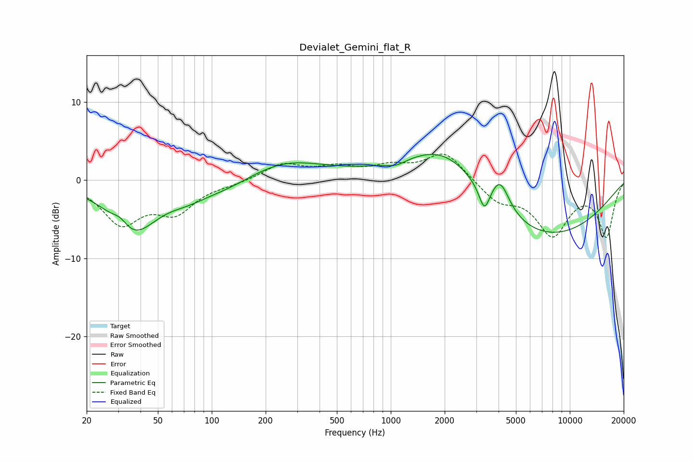

# Devialet_Gemini_flat_R
See [usage instructions](https://github.com/jaakkopasanen/AutoEq#usage) for more options and info.

### Parametric EQs
Apply preamp of -3.4 dB when using parametric equalizer.

|   # | Type    |   Fc (Hz) |    Q |   Gain (dB) |
|-----|---------|-----------|------|-------------|
|   1 | Peaking |        31 | 3.29 |         1.2 |
|   2 | Peaking |        36 | 1.05 |        -6.5 |
|   3 | Peaking |        72 | 1.36 |        -0.9 |
|   4 | Peaking |       117 | 0.73 |        -1.7 |
|   5 | Peaking |       248 | 0.61 |         2.7 |
|   6 | Peaking |      1069 | 2.5  |        -0.7 |
|   7 | Peaking |      2045 | 0.61 |         7.3 |
|   8 | Peaking |      3334 | 4.76 |        -3.2 |
|   9 | Peaking |      4084 | 2.8  |         3.7 |
|  10 | Peaking |      6187 | 0.31 |        -8.2 |

### Fixed Band EQs
When using fixed band (also called graphic) equalizer, apply preamp of **-3.4 dB** (if available) and set gains manually with these parameters.

|   # | Type    |   Fc (Hz) |    Q |   Gain (dB) |
|-----|---------|-----------|------|-------------|
|   1 | Peaking |        31 | 1.41 |        -5.3 |
|   2 | Peaking |        62 | 1.41 |        -3.7 |
|   3 | Peaking |       125 | 1.41 |        -0.4 |
|   4 | Peaking |       250 | 1.41 |         2   |
|   5 | Peaking |       500 | 1.41 |         1.4 |
|   6 | Peaking |      1000 | 1.41 |         1.4 |
|   7 | Peaking |      2000 | 1.41 |         3.6 |
|   8 | Peaking |      4000 | 1.41 |        -2.5 |
|   9 | Peaking |      8000 | 1.41 |        -6.7 |
|  10 | Peaking |     16000 | 1.41 |        -7   |

### Graphs

