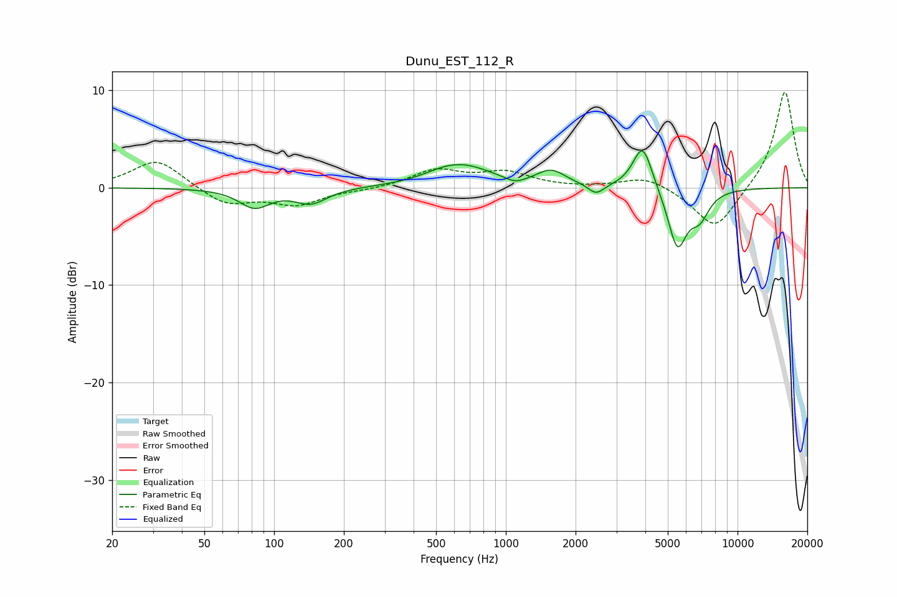

# Dunu_EST_112_R
See [usage instructions](https://github.com/jaakkopasanen/AutoEq#usage) for more options and info.

### Parametric EQs
Apply preamp of -3.9 dB when using parametric equalizer.

|   # | Type    |   Fc (Hz) |    Q |   Gain (dB) |
|-----|---------|-----------|------|-------------|
|   1 | Peaking |        82 | 2.17 |        -1.9 |
|   2 | Peaking |       144 | 2.03 |        -1.5 |
|   3 | Peaking |       520 | 1.97 |         0.3 |
|   4 | Peaking |       647 | 1.09 |         2.2 |
|   5 | Peaking |      1100 | 3.22 |        -0.6 |
|   6 | Peaking |      1569 | 2.29 |         1.5 |
|   7 | Peaking |      2453 | 4.11 |        -1.1 |
|   8 | Peaking |      3893 | 3.35 |         4.7 |
|   9 | Peaking |      5498 | 3.36 |        -6   |
|  10 | Peaking |      6864 | 3.24 |        -2.5 |

### Fixed Band EQs
When using fixed band (also called graphic) equalizer, apply preamp of **-9.9 dB** (if available) and set gains manually with these parameters.

|   # | Type    |   Fc (Hz) |    Q |   Gain (dB) |
|-----|---------|-----------|------|-------------|
|   1 | Peaking |        31 | 1.41 |         3   |
|   2 | Peaking |        62 | 1.41 |        -1.8 |
|   3 | Peaking |       125 | 1.41 |        -1.7 |
|   4 | Peaking |       250 | 1.41 |        -0.2 |
|   5 | Peaking |       500 | 1.41 |         1.8 |
|   6 | Peaking |      1000 | 1.41 |         1.5 |
|   7 | Peaking |      2000 | 1.41 |        -0   |
|   8 | Peaking |      4000 | 1.41 |         1.2 |
|   9 | Peaking |      8000 | 1.41 |        -4.4 |
|  10 | Peaking |     16000 | 1.41 |        10.1 |

### Graphs

