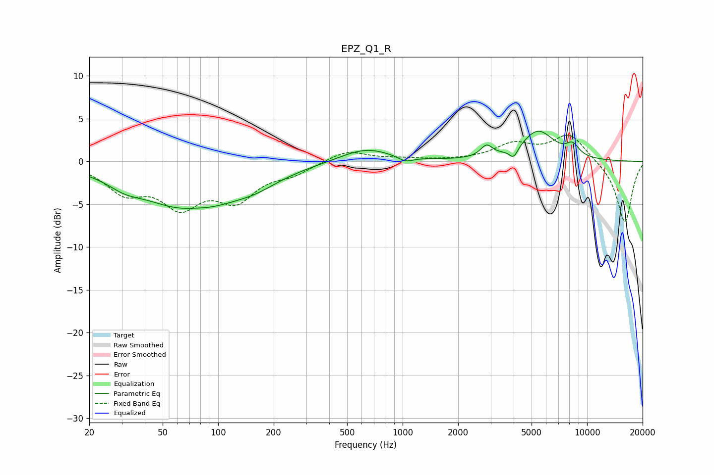

# EPZ_Q1_R
See [usage instructions](https://github.com/jaakkopasanen/AutoEq#usage) for more options and info.

### Parametric EQs
Apply preamp of -3.6 dB when using parametric equalizer.

|   # | Type    |   Fc (Hz) |    Q |   Gain (dB) |
|-----|---------|-----------|------|-------------|
|   1 | Peaking |        31 | 1.67 |        -0.9 |
|   2 | Peaking |        71 | 0.51 |        -5.5 |
|   3 | Peaking |        74 | 2.06 |         0.3 |
|   4 | Peaking |       160 | 1.16 |        -0.9 |
|   5 | Peaking |       630 | 1.01 |         1.6 |
|   6 | Peaking |      1036 | 3.41 |        -0.6 |
|   7 | Peaking |      2851 | 4.39 |         1.4 |
|   8 | Peaking |      3997 | 6    |        -1.2 |
|   9 | Peaking |      5419 | 1.56 |         3.5 |
|  10 | Peaking |      8353 | 3.74 |         1.3 |

### Fixed Band EQs
When using fixed band (also called graphic) equalizer, apply preamp of **-3.2 dB** (if available) and set gains manually with these parameters.

|   # | Type    |   Fc (Hz) |    Q |   Gain (dB) |
|-----|---------|-----------|------|-------------|
|   1 | Peaking |        31 | 1.41 |        -3.2 |
|   2 | Peaking |        62 | 1.41 |        -4.6 |
|   3 | Peaking |       125 | 1.41 |        -4   |
|   4 | Peaking |       250 | 1.41 |        -1.2 |
|   5 | Peaking |       500 | 1.41 |         1.3 |
|   6 | Peaking |      1000 | 1.41 |         0.3 |
|   7 | Peaking |      2000 | 1.41 |         0.1 |
|   8 | Peaking |      4000 | 1.41 |         1.9 |
|   9 | Peaking |      8000 | 1.41 |         3.2 |
|  10 | Peaking |     16000 | 1.41 |        -7.2 |

### Graphs

