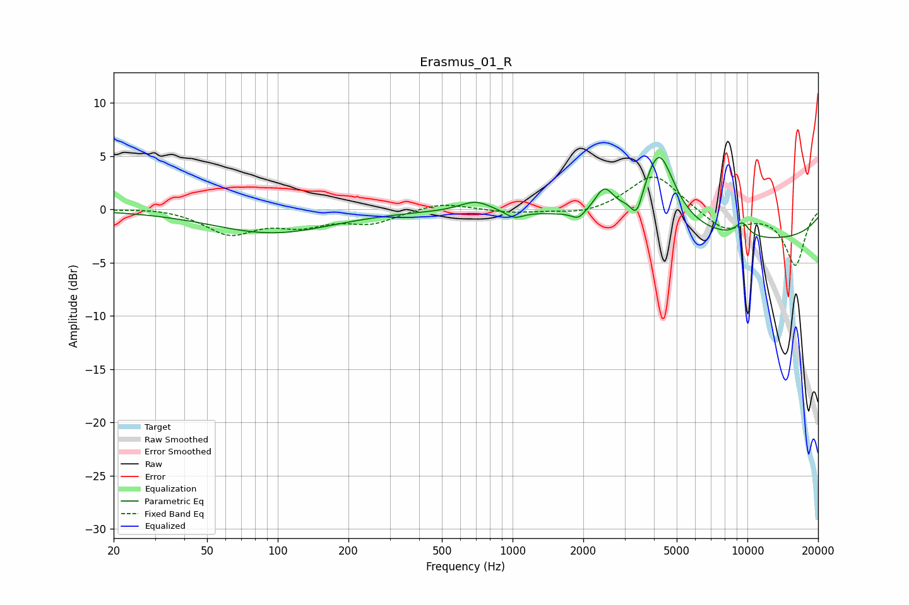

# Erasmus_01_R
See [usage instructions](https://github.com/jaakkopasanen/AutoEq#usage) for more options and info.

### Parametric EQs
Apply preamp of -5.0 dB when using parametric equalizer.

|   # | Type    |   Fc (Hz) |    Q |   Gain (dB) |
|-----|---------|-----------|------|-------------|
|   1 | Peaking |        95 | 0.56 |        -2.2 |
|   2 | Peaking |       695 | 2.11 |         1   |
|   3 | Peaking |      1014 | 3.67 |        -0.7 |
|   4 | Peaking |      1906 | 5.17 |        -0.7 |
|   5 | Peaking |      2456 | 3.55 |         2.4 |
|   6 | Peaking |      3379 | 5.73 |        -2.2 |
|   7 | Peaking |      4203 | 1.93 |         6.4 |
|   8 | Peaking |      4207 | 3.57 |         0.9 |
|   9 | Peaking |      9501 | 4.24 |         1.3 |
|  10 | Peaking |     10000 | 0.22 |        -2.9 |

### Fixed Band EQs
When using fixed band (also called graphic) equalizer, apply preamp of **-3.1 dB** (if available) and set gains manually with these parameters.

|   # | Type    |   Fc (Hz) |    Q |   Gain (dB) |
|-----|---------|-----------|------|-------------|
|   1 | Peaking |        31 | 1.41 |         0.2 |
|   2 | Peaking |        62 | 1.41 |        -2.2 |
|   3 | Peaking |       125 | 1.41 |        -1.3 |
|   4 | Peaking |       250 | 1.41 |        -1.2 |
|   5 | Peaking |       500 | 1.41 |         0.7 |
|   6 | Peaking |      1000 | 1.41 |        -0.3 |
|   7 | Peaking |      2000 | 1.41 |        -0.5 |
|   8 | Peaking |      4000 | 1.41 |         3.5 |
|   9 | Peaking |      8000 | 1.41 |        -1.9 |
|  10 | Peaking |     16000 | 1.41 |        -5.2 |

### Graphs

