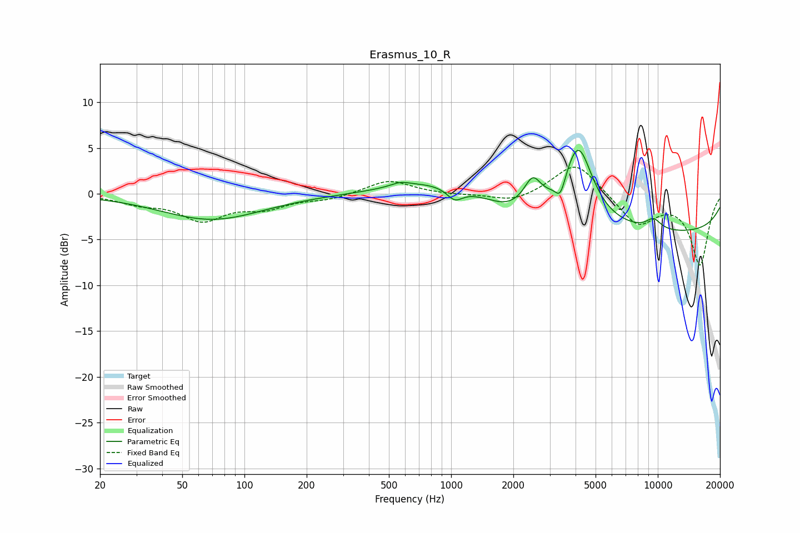

# Erasmus_10_R
See [usage instructions](https://github.com/jaakkopasanen/AutoEq#usage) for more options and info.

### Parametric EQs
Apply preamp of -4.8 dB when using parametric equalizer.

|   # | Type    |   Fc (Hz) |    Q |   Gain (dB) |
|-----|---------|-----------|------|-------------|
|   1 | Peaking |        70 | 0.57 |        -2.8 |
|   2 | Peaking |       568 | 3.09 |         0.5 |
|   3 | Peaking |       808 | 0.7  |         1.5 |
|   4 | Peaking |      1041 | 3.75 |        -1.3 |
|   5 | Peaking |      1843 | 1.92 |        -0.6 |
|   6 | Peaking |      2481 | 3.48 |         2.8 |
|   7 | Peaking |      3381 | 5.92 |        -2   |
|   8 | Peaking |      4121 | 2.01 |         8.3 |
|   9 | Peaking |      9542 | 3.4  |         1.2 |
|  10 | Peaking |     10000 | 0.18 |        -4.3 |

### Fixed Band EQs
When using fixed band (also called graphic) equalizer, apply preamp of **-3.0 dB** (if available) and set gains manually with these parameters.

|   # | Type    |   Fc (Hz) |    Q |   Gain (dB) |
|-----|---------|-----------|------|-------------|
|   1 | Peaking |        31 | 1.41 |        -0.9 |
|   2 | Peaking |        62 | 1.41 |        -2.7 |
|   3 | Peaking |       125 | 1.41 |        -1.4 |
|   4 | Peaking |       250 | 1.41 |        -0.6 |
|   5 | Peaking |       500 | 1.41 |         1.5 |
|   6 | Peaking |      1000 | 1.41 |        -0.1 |
|   7 | Peaking |      2000 | 1.41 |        -1   |
|   8 | Peaking |      4000 | 1.41 |         3.6 |
|   9 | Peaking |      8000 | 1.41 |        -3.4 |
|  10 | Peaking |     16000 | 1.41 |        -7.7 |

### Graphs

