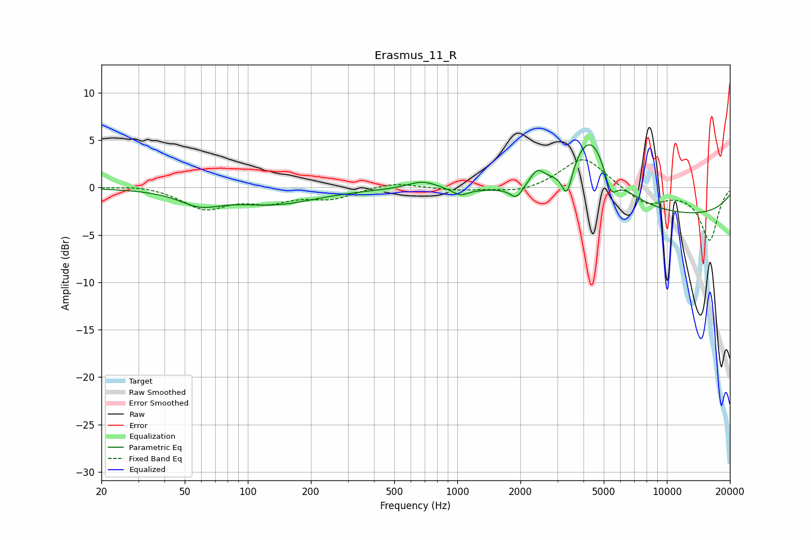

# Erasmus_11_R
See [usage instructions](https://github.com/jaakkopasanen/AutoEq#usage) for more options and info.

### Parametric EQs
Apply preamp of -4.6 dB when using parametric equalizer.

|   # | Type    |   Fc (Hz) |    Q |   Gain (dB) |
|-----|---------|-----------|------|-------------|
|   1 | Peaking |        59 | 1.47 |        -1.4 |
|   2 | Peaking |       133 | 0.68 |        -1.7 |
|   3 | Peaking |       681 | 2.01 |         0.8 |
|   4 | Peaking |      1033 | 3.62 |        -0.7 |
|   5 | Peaking |      1914 | 4.89 |        -1.2 |
|   6 | Peaking |      2404 | 3.97 |         1.7 |
|   7 | Peaking |      3338 | 5.69 |        -3.3 |
|   8 | Peaking |      4352 | 1.33 |         7.7 |
|   9 | Peaking |      5394 | 4.28 |        -3   |
|  10 | Peaking |     10000 | 0.22 |        -3.1 |

### Fixed Band EQs
When using fixed band (also called graphic) equalizer, apply preamp of **-3.0 dB** (if available) and set gains manually with these parameters.

|   # | Type    |   Fc (Hz) |    Q |   Gain (dB) |
|-----|---------|-----------|------|-------------|
|   1 | Peaking |        31 | 1.41 |         0.3 |
|   2 | Peaking |        62 | 1.41 |        -2.1 |
|   3 | Peaking |       125 | 1.41 |        -1.3 |
|   4 | Peaking |       250 | 1.41 |        -1.1 |
|   5 | Peaking |       500 | 1.41 |         0.6 |
|   6 | Peaking |      1000 | 1.41 |        -0.3 |
|   7 | Peaking |      2000 | 1.41 |        -0.6 |
|   8 | Peaking |      4000 | 1.41 |         3.3 |
|   9 | Peaking |      8000 | 1.41 |        -1.8 |
|  10 | Peaking |     16000 | 1.41 |        -5.5 |

### Graphs

