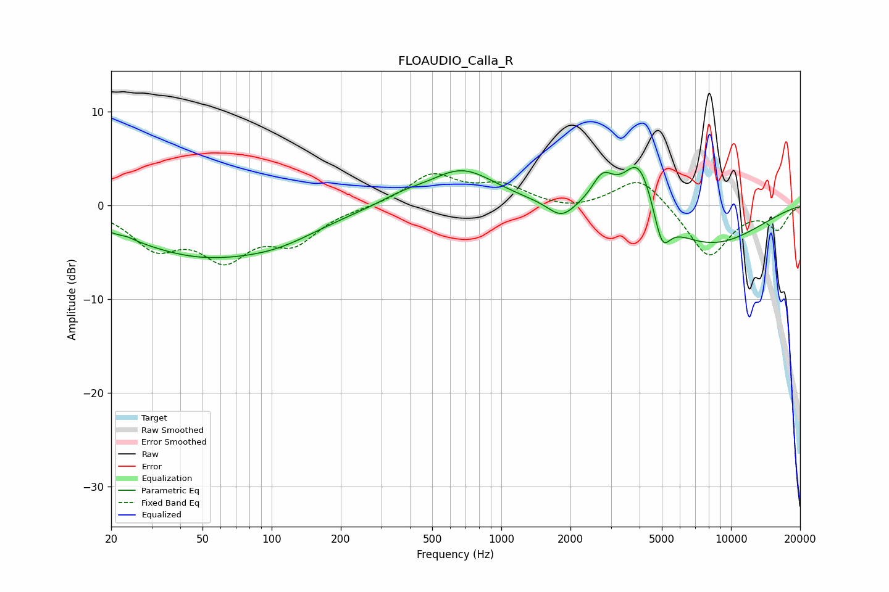

# FLOAUDIO_Calla_R
See [usage instructions](https://github.com/jaakkopasanen/AutoEq#usage) for more options and info.

### Parametric EQs
Apply preamp of -4.1 dB when using parametric equalizer.

|   # | Type    |   Fc (Hz) |    Q |   Gain (dB) |
|-----|---------|-----------|------|-------------|
|   1 | Peaking |        24 | 5.97 |         0.2 |
|   2 | Peaking |        48 | 0.43 |        -5.1 |
|   3 | Peaking |       110 | 0.78 |        -1.5 |
|   4 | Peaking |       365 | 1.47 |         0.7 |
|   5 | Peaking |       673 | 0.95 |         3.8 |
|   6 | Peaking |      1825 | 2.45 |        -1.7 |
|   7 | Peaking |      2763 | 2.94 |         3   |
|   8 | Peaking |      3976 | 1.94 |         6.6 |
|   9 | Peaking |      5007 | 3.91 |        -4   |
|  10 | Peaking |      7714 | 0.53 |        -4.4 |

### Fixed Band EQs
When using fixed band (also called graphic) equalizer, apply preamp of **-3.5 dB** (if available) and set gains manually with these parameters.

|   # | Type    |   Fc (Hz) |    Q |   Gain (dB) |
|-----|---------|-----------|------|-------------|
|   1 | Peaking |        31 | 1.41 |        -4   |
|   2 | Peaking |        62 | 1.41 |        -5   |
|   3 | Peaking |       125 | 1.41 |        -3.5 |
|   4 | Peaking |       250 | 1.41 |        -0.1 |
|   5 | Peaking |       500 | 1.41 |         3.2 |
|   6 | Peaking |      1000 | 1.41 |         2   |
|   7 | Peaking |      2000 | 1.41 |        -0.6 |
|   8 | Peaking |      4000 | 1.41 |         3.3 |
|   9 | Peaking |      8000 | 1.41 |        -5.6 |
|  10 | Peaking |     16000 | 1.41 |        -2.4 |

### Graphs

