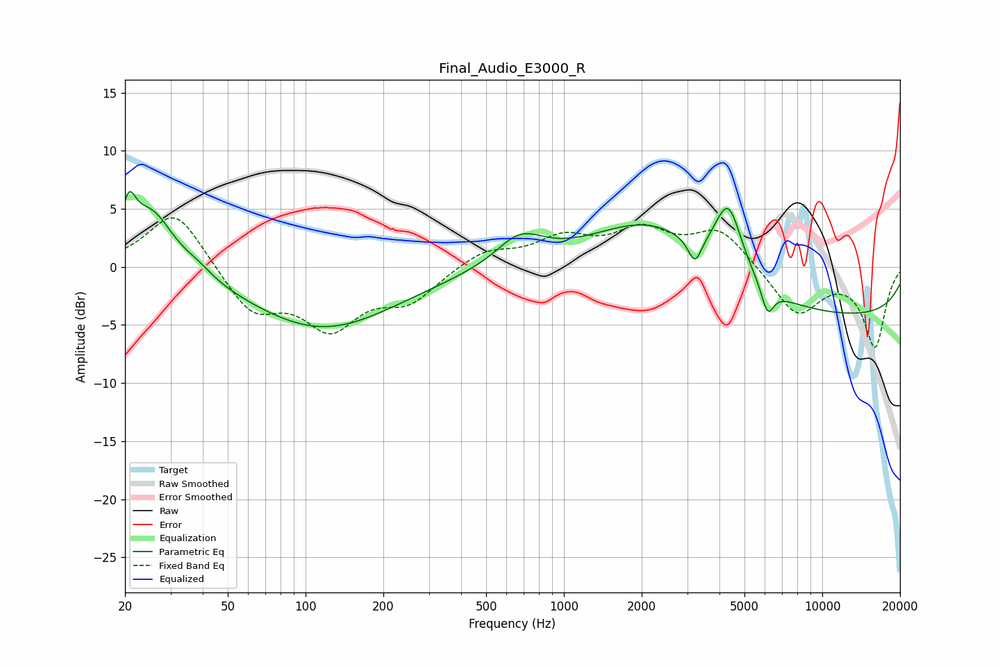

# Final_Audio_E3000_R
See [usage instructions](https://github.com/jaakkopasanen/AutoEq#usage) for more options and info.

### Parametric EQs
Apply preamp of -6.6 dB when using parametric equalizer.

|   # | Type    |   Fc (Hz) |    Q |   Gain (dB) |
|-----|---------|-----------|------|-------------|
|   1 | Peaking |        21 | 5.37 |         3.4 |
|   2 | Peaking |        25 | 1.6  |         5.3 |
|   3 | Peaking |        38 | 2.51 |         0.6 |
|   4 | Peaking |       116 | 0.49 |        -5.3 |
|   5 | Peaking |       675 | 1.56 |         2.5 |
|   6 | Peaking |      2224 | 0.61 |         5.5 |
|   7 | Peaking |      3216 | 5.39 |        -2.3 |
|   8 | Peaking |      4330 | 2.65 |         5.9 |
|   9 | Peaking |      6141 | 5.68 |        -2.4 |
|  10 | Peaking |     10000 | 0.18 |        -4.4 |

### Fixed Band EQs
When using fixed band (also called graphic) equalizer, apply preamp of **-4.3 dB** (if available) and set gains manually with these parameters.

|   # | Type    |   Fc (Hz) |    Q |   Gain (dB) |
|-----|---------|-----------|------|-------------|
|   1 | Peaking |        31 | 1.41 |         5.1 |
|   2 | Peaking |        62 | 1.41 |        -3.8 |
|   3 | Peaking |       125 | 1.41 |        -4.8 |
|   4 | Peaking |       250 | 1.41 |        -2.7 |
|   5 | Peaking |       500 | 1.41 |         1.5 |
|   6 | Peaking |      1000 | 1.41 |         2.2 |
|   7 | Peaking |      2000 | 1.41 |         2.8 |
|   8 | Peaking |      4000 | 1.41 |         3.2 |
|   9 | Peaking |      8000 | 1.41 |        -4.1 |
|  10 | Peaking |     16000 | 1.41 |        -6.8 |

### Graphs

