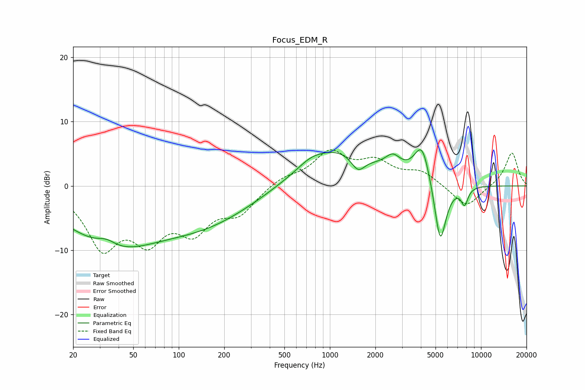

# Focus_EDM_R
See [usage instructions](https://github.com/jaakkopasanen/AutoEq#usage) for more options and info.

### Parametric EQs
Apply preamp of -5.7 dB when using parametric equalizer.

|   # | Type    |   Fc (Hz) |    Q |   Gain (dB) |
|-----|---------|-----------|------|-------------|
|   1 | Peaking |        33 | 2.23 |         1.3 |
|   2 | Peaking |        36 | 0.44 |        -8.7 |
|   3 | Peaking |       159 | 0.44 |        -4.7 |
|   4 | Peaking |       742 | 1.79 |         0.9 |
|   5 | Peaking |      1111 | 0.58 |         5.8 |
|   6 | Peaking |      1536 | 3.03 |        -2.5 |
|   7 | Peaking |      2610 | 2.8  |         2.2 |
|   8 | Peaking |      4082 | 2.61 |         6.2 |
|   9 | Peaking |      5372 | 3.44 |       -10.3 |
|  10 | Peaking |      7786 | 5.89 |        -2.6 |

### Fixed Band EQs
When using fixed band (also called graphic) equalizer, apply preamp of **-5.7 dB** (if available) and set gains manually with these parameters.

|   # | Type    |   Fc (Hz) |    Q |   Gain (dB) |
|-----|---------|-----------|------|-------------|
|   1 | Peaking |        31 | 1.41 |        -8.9 |
|   2 | Peaking |        62 | 1.41 |        -7   |
|   3 | Peaking |       125 | 1.41 |        -6   |
|   4 | Peaking |       250 | 1.41 |        -3.8 |
|   5 | Peaking |       500 | 1.41 |         1.3 |
|   6 | Peaking |      1000 | 1.41 |         4.9 |
|   7 | Peaking |      2000 | 1.41 |         3.2 |
|   8 | Peaking |      4000 | 1.41 |         2   |
|   9 | Peaking |      8000 | 1.41 |        -3.5 |
|  10 | Peaking |     16000 | 1.41 |         5.3 |

### Graphs

