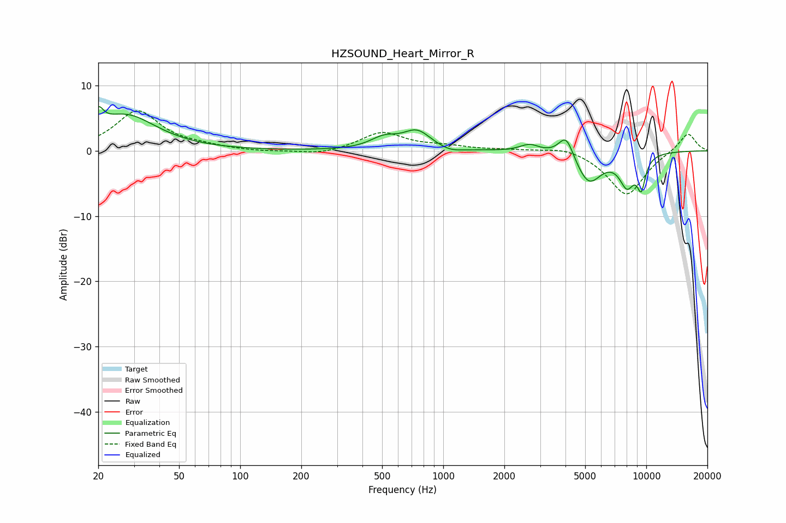

# HZSOUND_Heart_Mirror_R
See [usage instructions](https://github.com/jaakkopasanen/AutoEq#usage) for more options and info.

### Parametric EQs
Apply preamp of -6.8 dB when using parametric equalizer.

|   # | Type    |   Fc (Hz) |    Q |   Gain (dB) |
|-----|---------|-----------|------|-------------|
|   1 | Peaking |        20 | 5.74 |         2.7 |
|   2 | Peaking |        27 | 0.93 |         5.4 |
|   3 | Peaking |       510 | 2.09 |         1.6 |
|   4 | Peaking |       743 | 2.07 |         2.8 |
|   5 | Peaking |      1082 | 2.39 |        -0.6 |
|   6 | Peaking |      2662 | 3.04 |         1.1 |
|   7 | Peaking |      4033 | 3.77 |         3.6 |
|   8 | Peaking |      5197 | 2.16 |        -4.9 |
|   9 | Peaking |      8045 | 3.33 |        -4.6 |
|  10 | Peaking |      9449 | 6    |        -4.4 |

### Fixed Band EQs
When using fixed band (also called graphic) equalizer, apply preamp of **-6.2 dB** (if available) and set gains manually with these parameters.

|   # | Type    |   Fc (Hz) |    Q |   Gain (dB) |
|-----|---------|-----------|------|-------------|
|   1 | Peaking |        31 | 1.41 |         6   |
|   2 | Peaking |        62 | 1.41 |         0.5 |
|   3 | Peaking |       125 | 1.41 |        -0.2 |
|   4 | Peaking |       250 | 1.41 |        -0.7 |
|   5 | Peaking |       500 | 1.41 |         2.8 |
|   6 | Peaking |      1000 | 1.41 |         0.6 |
|   7 | Peaking |      2000 | 1.41 |         0.2 |
|   8 | Peaking |      4000 | 1.41 |         0.8 |
|   9 | Peaking |      8000 | 1.41 |        -6.9 |
|  10 | Peaking |     16000 | 1.41 |         2.9 |

### Graphs

