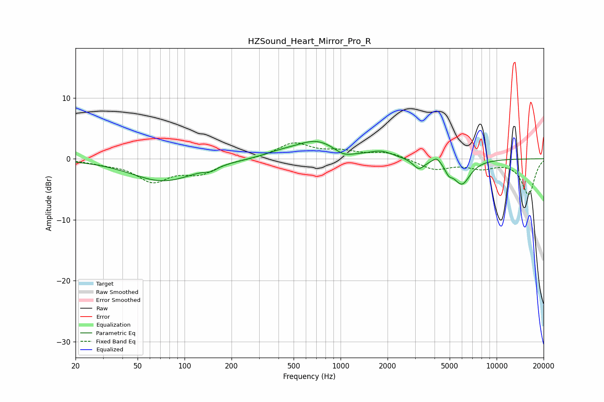

# HZSound_Heart_Mirror_Pro_R
See [usage instructions](https://github.com/jaakkopasanen/AutoEq#usage) for more options and info.

### Parametric EQs
Apply preamp of -2.9 dB when using parametric equalizer.

|   # | Type    |   Fc (Hz) |    Q |   Gain (dB) |
|-----|---------|-----------|------|-------------|
|   1 | Peaking |        73 | 0.69 |        -3.6 |
|   2 | Peaking |       148 | 3.76 |        -0.6 |
|   3 | Peaking |       407 | 1.32 |         0.6 |
|   4 | Peaking |       706 | 1    |         2.9 |
|   5 | Peaking |      1043 | 2.36 |        -1.1 |
|   6 | Peaking |      1824 | 1.99 |         1   |
|   7 | Peaking |      3170 | 3.94 |        -1.6 |
|   8 | Peaking |      4135 | 5.22 |         1   |
|   9 | Peaking |      4932 | 5.93 |        -1.2 |
|  10 | Peaking |      5983 | 2.52 |        -4.1 |

### Fixed Band EQs
When using fixed band (also called graphic) equalizer, apply preamp of **-2.7 dB** (if available) and set gains manually with these parameters.

|   # | Type    |   Fc (Hz) |    Q |   Gain (dB) |
|-----|---------|-----------|------|-------------|
|   1 | Peaking |        31 | 1.41 |        -0.6 |
|   2 | Peaking |        62 | 1.41 |        -3.5 |
|   3 | Peaking |       125 | 1.41 |        -2.2 |
|   4 | Peaking |       250 | 1.41 |        -0.1 |
|   5 | Peaking |       500 | 1.41 |         2.5 |
|   6 | Peaking |      1000 | 1.41 |         1   |
|   7 | Peaking |      2000 | 1.41 |         1   |
|   8 | Peaking |      4000 | 1.41 |        -1.7 |
|   9 | Peaking |      8000 | 1.41 |        -1.3 |
|  10 | Peaking |     16000 | 1.41 |        -5.8 |

### Graphs

