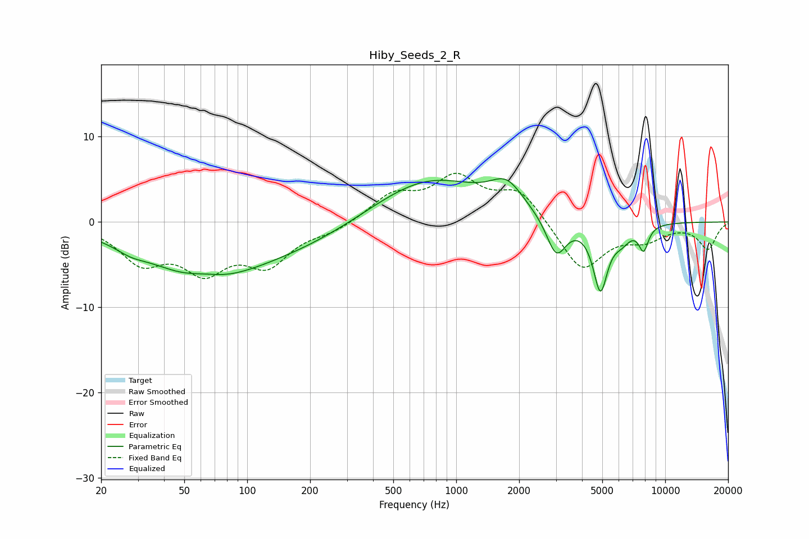

# Hiby_Seeds_2_R
See [usage instructions](https://github.com/jaakkopasanen/AutoEq#usage) for more options and info.

### Parametric EQs
Apply preamp of -5.2 dB when using parametric equalizer.

|   # | Type    |   Fc (Hz) |    Q |   Gain (dB) |
|-----|---------|-----------|------|-------------|
|   1 | Peaking |        28 | 2.08 |        -0.7 |
|   2 | Peaking |        61 | 0.52 |        -6.2 |
|   3 | Peaking |        63 | 1.63 |         0.8 |
|   4 | Peaking |       192 | 0.47 |        -2.1 |
|   5 | Peaking |       733 | 0.52 |         5.3 |
|   6 | Peaking |      1745 | 1.82 |         3   |
|   7 | Peaking |      3012 | 2.93 |        -4.6 |
|   8 | Peaking |      4899 | 3.94 |        -7.7 |
|   9 | Peaking |      6194 | 3.16 |        -1.5 |
|  10 | Peaking |      7883 | 5.7  |        -2.8 |

### Fixed Band EQs
When using fixed band (also called graphic) equalizer, apply preamp of **-5.8 dB** (if available) and set gains manually with these parameters.

|   # | Type    |   Fc (Hz) |    Q |   Gain (dB) |
|-----|---------|-----------|------|-------------|
|   1 | Peaking |        31 | 1.41 |        -4.3 |
|   2 | Peaking |        62 | 1.41 |        -5   |
|   3 | Peaking |       125 | 1.41 |        -4.5 |
|   4 | Peaking |       250 | 1.41 |        -1   |
|   5 | Peaking |       500 | 1.41 |         3   |
|   6 | Peaking |      1000 | 1.41 |         4.8 |
|   7 | Peaking |      2000 | 1.41 |         3.6 |
|   8 | Peaking |      4000 | 1.41 |        -5.8 |
|   9 | Peaking |      8000 | 1.41 |        -1.8 |
|  10 | Peaking |     16000 | 1.41 |        -3.1 |

### Graphs

