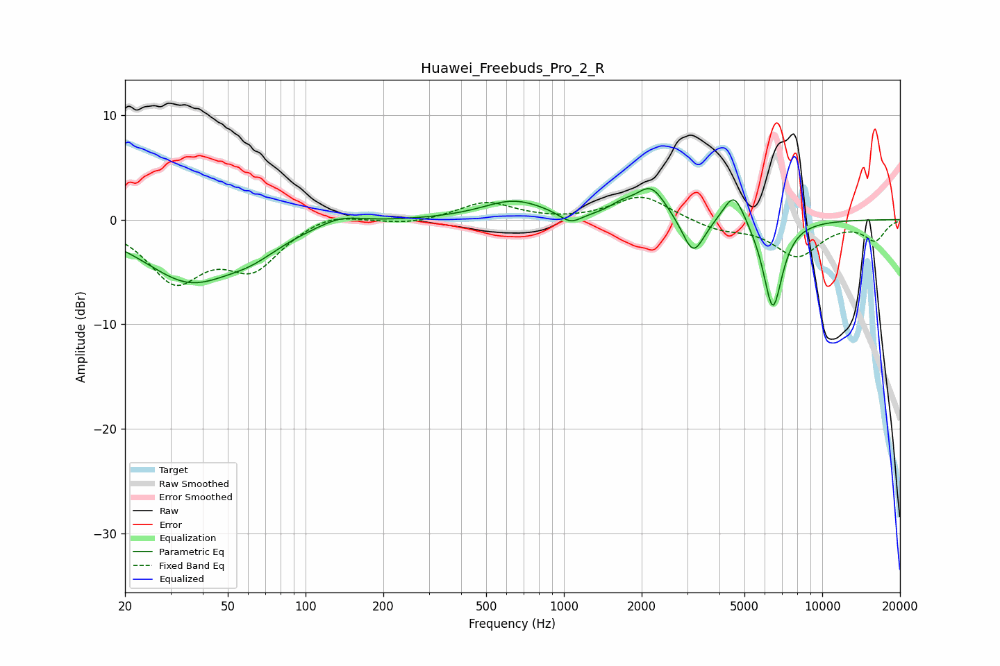

# Huawei_Freebuds_Pro_2_R
See [usage instructions](https://github.com/jaakkopasanen/AutoEq#usage) for more options and info.

### Parametric EQs
Apply preamp of -3.0 dB when using parametric equalizer.

|   # | Type    |   Fc (Hz) |    Q |   Gain (dB) |
|-----|---------|-----------|------|-------------|
|   1 | Peaking |        36 | 0.78 |        -5.6 |
|   2 | Peaking |        62 | 1.31 |        -1.4 |
|   3 | Peaking |       136 | 1.68 |         0.9 |
|   4 | Peaking |       641 | 1.16 |         1.8 |
|   5 | Peaking |      1062 | 3.25 |        -1.1 |
|   6 | Peaking |      1669 | 2.95 |         0.8 |
|   7 | Peaking |      2174 | 2.35 |         3.1 |
|   8 | Peaking |      3168 | 3.31 |        -3.7 |
|   9 | Peaking |      4556 | 3.32 |         3.2 |
|  10 | Peaking |      6438 | 3.61 |        -8.6 |

### Fixed Band EQs
When using fixed band (also called graphic) equalizer, apply preamp of **-2.2 dB** (if available) and set gains manually with these parameters.

|   # | Type    |   Fc (Hz) |    Q |   Gain (dB) |
|-----|---------|-----------|------|-------------|
|   1 | Peaking |        31 | 1.41 |        -5.5 |
|   2 | Peaking |        62 | 1.41 |        -4.2 |
|   3 | Peaking |       125 | 1.41 |         0.9 |
|   4 | Peaking |       250 | 1.41 |        -0.4 |
|   5 | Peaking |       500 | 1.41 |         1.7 |
|   6 | Peaking |      1000 | 1.41 |        -0.1 |
|   7 | Peaking |      2000 | 1.41 |         2.3 |
|   8 | Peaking |      4000 | 1.41 |        -0.9 |
|   9 | Peaking |      8000 | 1.41 |        -3.4 |
|  10 | Peaking |     16000 | 1.41 |        -1.9 |

### Graphs

