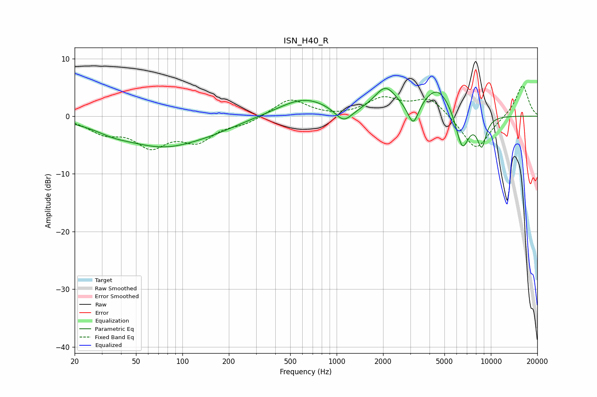

# ISN_H40_R
See [usage instructions](https://github.com/jaakkopasanen/AutoEq#usage) for more options and info.

### Parametric EQs
Apply preamp of -4.9 dB when using parametric equalizer.

|   # | Type    |   Fc (Hz) |    Q |   Gain (dB) |
|-----|---------|-----------|------|-------------|
|   1 | Peaking |        35 | 1.32 |        -0.9 |
|   2 | Peaking |        75 | 0.52 |        -5.1 |
|   3 | Peaking |       167 | 0.88 |        -0.6 |
|   4 | Peaking |       614 | 0.84 |         3.2 |
|   5 | Peaking |      1110 | 2.53 |        -2.5 |
|   6 | Peaking |      2072 | 1.96 |         4.3 |
|   7 | Peaking |      3139 | 4.07 |        -4.1 |
|   8 | Peaking |      4529 | 1.43 |         5.2 |
|   9 | Peaking |      6522 | 3.09 |        -6.8 |
|  10 | Peaking |      8723 | 4.33 |        -5   |

### Fixed Band EQs
When using fixed band (also called graphic) equalizer, apply preamp of **-5.3 dB** (if available) and set gains manually with these parameters.

|   # | Type    |   Fc (Hz) |    Q |   Gain (dB) |
|-----|---------|-----------|------|-------------|
|   1 | Peaking |        31 | 1.41 |        -2.5 |
|   2 | Peaking |        62 | 1.41 |        -4.7 |
|   3 | Peaking |       125 | 1.41 |        -3.8 |
|   4 | Peaking |       250 | 1.41 |        -1.1 |
|   5 | Peaking |       500 | 1.41 |         3.1 |
|   6 | Peaking |      1000 | 1.41 |        -0.2 |
|   7 | Peaking |      2000 | 1.41 |         2.9 |
|   8 | Peaking |      4000 | 1.41 |         3.2 |
|   9 | Peaking |      8000 | 1.41 |        -6.1 |
|  10 | Peaking |     16000 | 1.41 |         5.5 |

### Graphs

