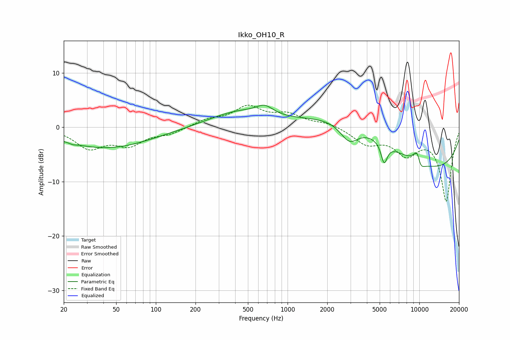

# Ikko_OH10_R
See [usage instructions](https://github.com/jaakkopasanen/AutoEq#usage) for more options and info.

### Parametric EQs
Apply preamp of -4.1 dB when using parametric equalizer.

|   # | Type    |   Fc (Hz) |    Q |   Gain (dB) |
|-----|---------|-----------|------|-------------|
|   1 | Peaking |        24 | 5.75 |        -0.2 |
|   2 | Peaking |        42 | 0.42 |        -3.8 |
|   3 | Peaking |       417 | 0.64 |         2.7 |
|   4 | Peaking |       670 | 2.17 |         1.7 |
|   5 | Peaking |      2942 | 1.98 |        -3.6 |
|   6 | Peaking |      3380 | 0.43 |         6   |
|   7 | Peaking |      5407 | 5.89 |        -3.7 |
|   8 | Peaking |      9686 | 4.11 |         4.7 |
|   9 | Peaking |     10000 | 3.71 |        -3.7 |
|  10 | Peaking |     10000 | 0.22 |        -8.5 |

### Fixed Band EQs
When using fixed band (also called graphic) equalizer, apply preamp of **-4.1 dB** (if available) and set gains manually with these parameters.

|   # | Type    |   Fc (Hz) |    Q |   Gain (dB) |
|-----|---------|-----------|------|-------------|
|   1 | Peaking |        31 | 1.41 |        -3.6 |
|   2 | Peaking |        62 | 1.41 |        -3   |
|   3 | Peaking |       125 | 1.41 |        -1.1 |
|   4 | Peaking |       250 | 1.41 |         1.3 |
|   5 | Peaking |       500 | 1.41 |         3.5 |
|   6 | Peaking |      1000 | 1.41 |         2.1 |
|   7 | Peaking |      2000 | 1.41 |         0.8 |
|   8 | Peaking |      4000 | 1.41 |        -2.8 |
|   9 | Peaking |      8000 | 1.41 |        -4.4 |
|  10 | Peaking |     16000 | 1.41 |       -13.5 |

### Graphs

