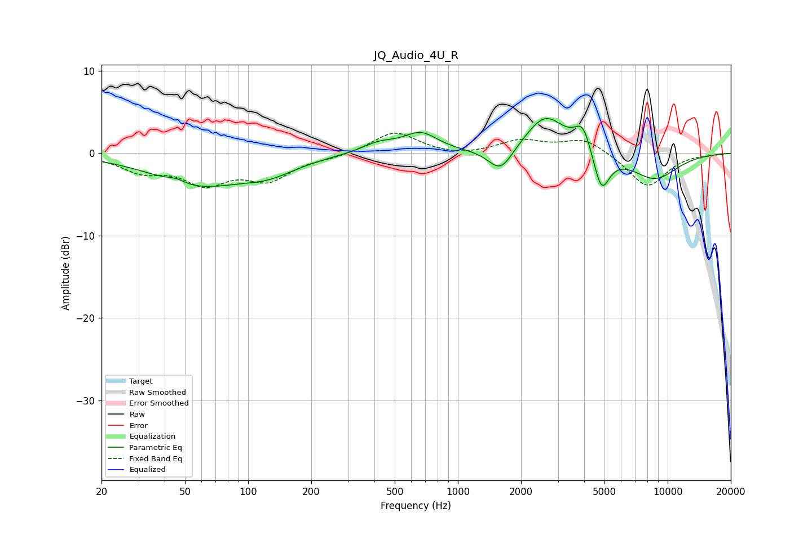

# JQ_Audio_4U_R
See [usage instructions](https://github.com/jaakkopasanen/AutoEq#usage) for more options and info.

### Parametric EQs
Apply preamp of -4.3 dB when using parametric equalizer.

|   # | Type    |   Fc (Hz) |    Q |   Gain (dB) |
|-----|---------|-----------|------|-------------|
|   1 | Peaking |        45 | 3.56 |         0.5 |
|   2 | Peaking |        57 | 0.65 |        -3.7 |
|   3 | Peaking |       125 | 1.05 |        -1.7 |
|   4 | Peaking |       420 | 1.67 |         1.1 |
|   5 | Peaking |       665 | 1.73 |         2.3 |
|   6 | Peaking |      1598 | 2.41 |        -3   |
|   7 | Peaking |      2615 | 1.5  |         4.6 |
|   8 | Peaking |      3945 | 3.54 |         3.2 |
|   9 | Peaking |      4833 | 3.64 |        -4.8 |
|  10 | Peaking |      8661 | 1.15 |        -3.1 |

### Fixed Band EQs
When using fixed band (also called graphic) equalizer, apply preamp of **-2.5 dB** (if available) and set gains manually with these parameters.

|   # | Type    |   Fc (Hz) |    Q |   Gain (dB) |
|-----|---------|-----------|------|-------------|
|   1 | Peaking |        31 | 1.41 |        -2   |
|   2 | Peaking |        62 | 1.41 |        -3.3 |
|   3 | Peaking |       125 | 1.41 |        -2.9 |
|   4 | Peaking |       250 | 1.41 |        -0.4 |
|   5 | Peaking |       500 | 1.41 |         2.7 |
|   6 | Peaking |      1000 | 1.41 |        -0.4 |
|   7 | Peaking |      2000 | 1.41 |         1.5 |
|   8 | Peaking |      4000 | 1.41 |         1.8 |
|   9 | Peaking |      8000 | 1.41 |        -4.2 |
|  10 | Peaking |     16000 | 1.41 |        -0.1 |

### Graphs

