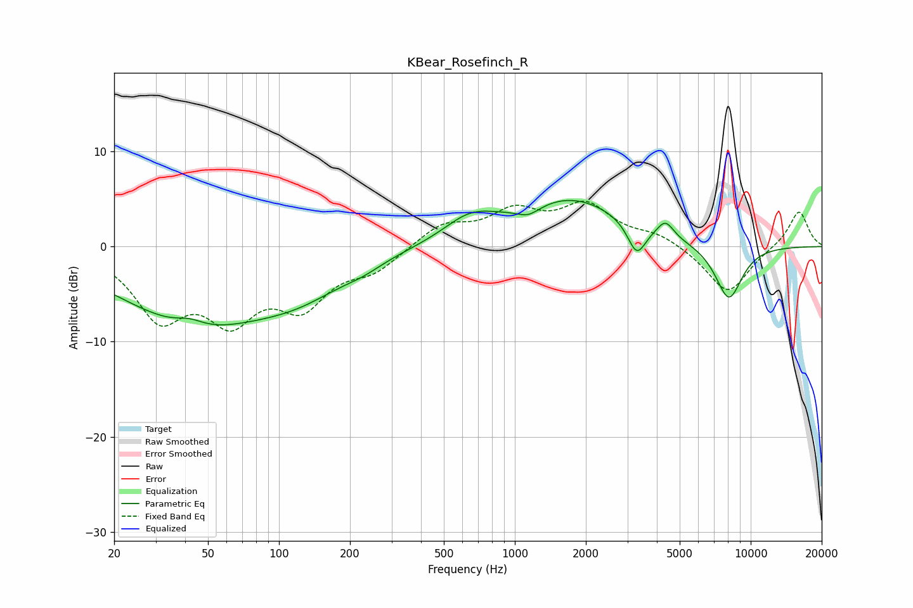

# KBear_Rosefinch_R
See [usage instructions](https://github.com/jaakkopasanen/AutoEq#usage) for more options and info.

### Parametric EQs
Apply preamp of -4.9 dB when using parametric equalizer.

|   # | Type    |   Fc (Hz) |    Q |   Gain (dB) |
|-----|---------|-----------|------|-------------|
|   1 | Peaking |        42 | 2.39 |         0.8 |
|   2 | Peaking |        44 | 0.43 |        -7.8 |
|   3 | Peaking |       124 | 0.7  |        -2.8 |
|   4 | Peaking |       228 | 1.79 |        -0.6 |
|   5 | Peaking |       646 | 1.26 |         2.3 |
|   6 | Peaking |      1143 | 2.85 |        -1   |
|   7 | Peaking |      1730 | 0.6  |         5   |
|   8 | Peaking |      3287 | 3.64 |        -3.3 |
|   9 | Peaking |      4352 | 4.06 |         1.7 |
|  10 | Peaking |      8073 | 2.22 |        -5.8 |

### Fixed Band EQs
When using fixed band (also called graphic) equalizer, apply preamp of **-4.9 dB** (if available) and set gains manually with these parameters.

|   # | Type    |   Fc (Hz) |    Q |   Gain (dB) |
|-----|---------|-----------|------|-------------|
|   1 | Peaking |        31 | 1.41 |        -6.9 |
|   2 | Peaking |        62 | 1.41 |        -6.5 |
|   3 | Peaking |       125 | 1.41 |        -5.4 |
|   4 | Peaking |       250 | 1.41 |        -2.2 |
|   5 | Peaking |       500 | 1.41 |         2.3 |
|   6 | Peaking |      1000 | 1.41 |         3.3 |
|   7 | Peaking |      2000 | 1.41 |         4   |
|   8 | Peaking |      4000 | 1.41 |         1.2 |
|   9 | Peaking |      8000 | 1.41 |        -5   |
|  10 | Peaking |     16000 | 1.41 |         3.9 |

### Graphs

