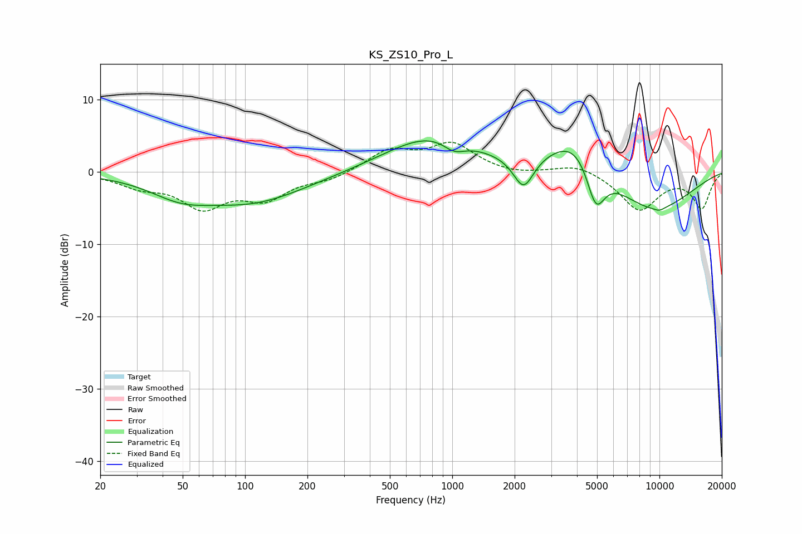

# KS_ZS10_Pro_L
See [usage instructions](https://github.com/jaakkopasanen/AutoEq#usage) for more options and info.

### Parametric EQs
Apply preamp of -4.4 dB when using parametric equalizer.

|   # | Type    |   Fc (Hz) |    Q |   Gain (dB) |
|-----|---------|-----------|------|-------------|
|   1 | Peaking |        49 | 0.94 |        -2.4 |
|   2 | Peaking |       108 | 0.58 |        -3.4 |
|   3 | Peaking |       124 | 0.43 |        -0.6 |
|   4 | Peaking |       807 | 0.63 |         5.1 |
|   5 | Peaking |      1022 | 2.53 |        -1.6 |
|   6 | Peaking |      2209 | 2.86 |        -4.6 |
|   7 | Peaking |      4086 | 0.98 |         6.5 |
|   8 | Peaking |      4926 | 2.91 |        -6.8 |
|   9 | Peaking |      8996 | 0.59 |        -5.8 |
|  10 | Peaking |     10000 | 4.82 |        -0.4 |

### Fixed Band EQs
When using fixed band (also called graphic) equalizer, apply preamp of **-4.2 dB** (if available) and set gains manually with these parameters.

|   # | Type    |   Fc (Hz) |    Q |   Gain (dB) |
|-----|---------|-----------|------|-------------|
|   1 | Peaking |        31 | 1.41 |        -1.7 |
|   2 | Peaking |        62 | 1.41 |        -4.5 |
|   3 | Peaking |       125 | 1.41 |        -3.3 |
|   4 | Peaking |       250 | 1.41 |        -1   |
|   5 | Peaking |       500 | 1.41 |         2.9 |
|   6 | Peaking |      1000 | 1.41 |         3.7 |
|   7 | Peaking |      2000 | 1.41 |        -0.4 |
|   8 | Peaking |      4000 | 1.41 |         1.2 |
|   9 | Peaking |      8000 | 1.41 |        -5.2 |
|  10 | Peaking |     16000 | 1.41 |        -4.9 |

### Graphs

