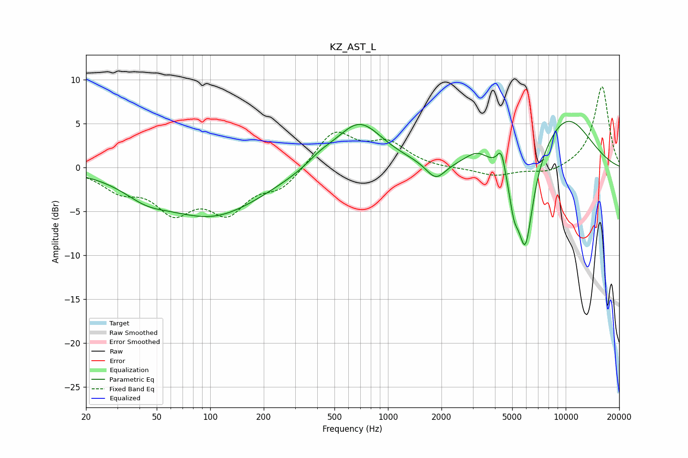

# KZ_AST_L
See [usage instructions](https://github.com/jaakkopasanen/AutoEq#usage) for more options and info.

### Parametric EQs
Apply preamp of -5.3 dB when using parametric equalizer.

|   # | Type    |   Fc (Hz) |    Q |   Gain (dB) |
|-----|---------|-----------|------|-------------|
|   1 | Peaking |        43 | 1.16 |        -1.5 |
|   2 | Peaking |       103 | 0.49 |        -5.4 |
|   3 | Peaking |       417 | 1.83 |         0.8 |
|   4 | Peaking |       688 | 1.05 |         5.2 |
|   5 | Peaking |      1859 | 2.59 |        -2   |
|   6 | Peaking |      3169 | 2.06 |         1.5 |
|   7 | Peaking |      4340 | 6    |         2.6 |
|   8 | Peaking |      5107 | 5.3  |        -3.1 |
|   9 | Peaking |      5927 | 2.95 |       -11   |
|  10 | Peaking |     10000 | 0.77 |         5.9 |

### Fixed Band EQs
When using fixed band (also called graphic) equalizer, apply preamp of **-9.3 dB** (if available) and set gains manually with these parameters.

|   # | Type    |   Fc (Hz) |    Q |   Gain (dB) |
|-----|---------|-----------|------|-------------|
|   1 | Peaking |        31 | 1.41 |        -2.2 |
|   2 | Peaking |        62 | 1.41 |        -4.4 |
|   3 | Peaking |       125 | 1.41 |        -4.5 |
|   4 | Peaking |       250 | 1.41 |        -2.2 |
|   5 | Peaking |       500 | 1.41 |         4.1 |
|   6 | Peaking |      1000 | 1.41 |         2.6 |
|   7 | Peaking |      2000 | 1.41 |        -0.2 |
|   8 | Peaking |      4000 | 1.41 |        -1   |
|   9 | Peaking |      8000 | 1.41 |        -0.7 |
|  10 | Peaking |     16000 | 1.41 |         9.3 |

### Graphs

