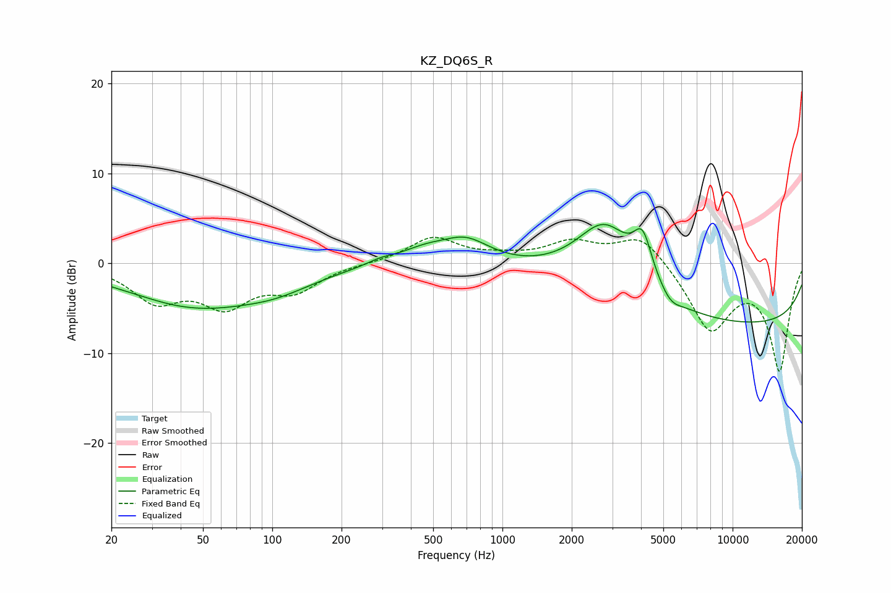

# KZ_DQ6S_R
See [usage instructions](https://github.com/jaakkopasanen/AutoEq#usage) for more options and info.

### Parametric EQs
Apply preamp of -4.4 dB when using parametric equalizer.

|   # | Type    |   Fc (Hz) |    Q |   Gain (dB) |
|-----|---------|-----------|------|-------------|
|   1 | Peaking |        28 | 2.96 |         0   |
|   2 | Peaking |        47 | 0.47 |        -4.7 |
|   3 | Peaking |       106 | 0.91 |        -1.3 |
|   4 | Peaking |       297 | 2.25 |         0.5 |
|   5 | Peaking |       457 | 1.34 |         1.3 |
|   6 | Peaking |       694 | 1.35 |         2.5 |
|   7 | Peaking |      2791 | 1.06 |         8.1 |
|   8 | Peaking |      4068 | 3.4  |         4.8 |
|   9 | Peaking |      5382 | 3.16 |        -1.1 |
|  10 | Peaking |     10000 | 0.18 |        -6.9 |

### Fixed Band EQs
When using fixed band (also called graphic) equalizer, apply preamp of **-3.0 dB** (if available) and set gains manually with these parameters.

|   # | Type    |   Fc (Hz) |    Q |   Gain (dB) |
|-----|---------|-----------|------|-------------|
|   1 | Peaking |        31 | 1.41 |        -3.9 |
|   2 | Peaking |        62 | 1.41 |        -4.2 |
|   3 | Peaking |       125 | 1.41 |        -2.7 |
|   4 | Peaking |       250 | 1.41 |        -0   |
|   5 | Peaking |       500 | 1.41 |         2.8 |
|   6 | Peaking |      1000 | 1.41 |         0.5 |
|   7 | Peaking |      2000 | 1.41 |         2.2 |
|   8 | Peaking |      4000 | 1.41 |         3.3 |
|   9 | Peaking |      8000 | 1.41 |        -7.3 |
|  10 | Peaking |     16000 | 1.41 |       -11.7 |

### Graphs

