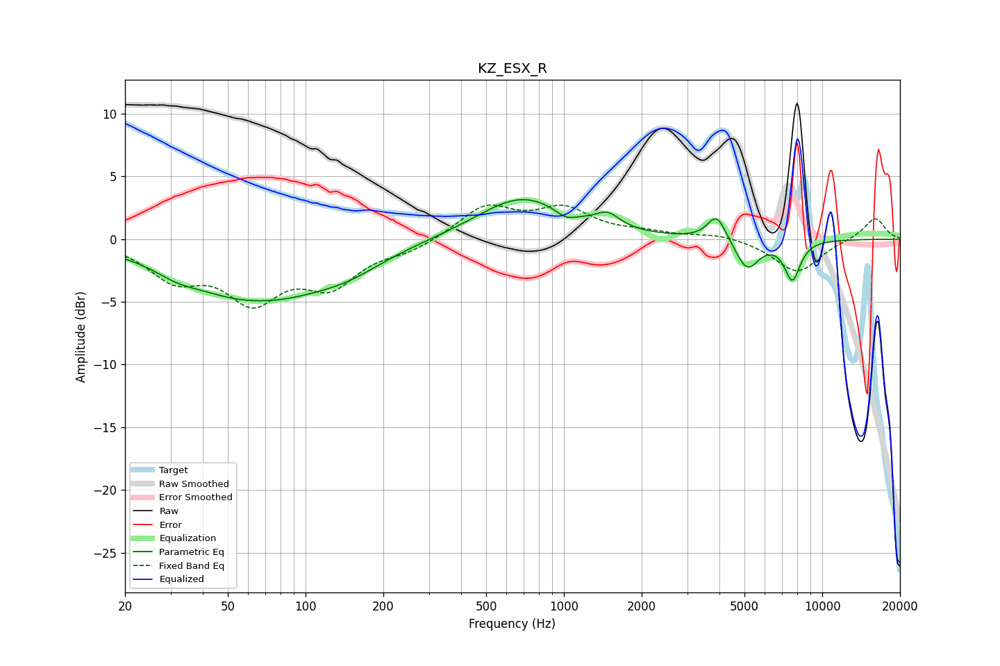

# KZ_ESX_R
See [usage instructions](https://github.com/jaakkopasanen/AutoEq#usage) for more options and info.

### Parametric EQs
Apply preamp of -3.2 dB when using parametric equalizer.

|   # | Type    |   Fc (Hz) |    Q |   Gain (dB) |
|-----|---------|-----------|------|-------------|
|   1 | Peaking |        32 | 1.74 |        -0.6 |
|   2 | Peaking |        65 | 0.54 |        -4.9 |
|   3 | Peaking |        67 | 1.33 |         0.3 |
|   4 | Peaking |       145 | 0.99 |        -1.2 |
|   5 | Peaking |       688 | 0.82 |         3.4 |
|   6 | Peaking |      1016 | 3.54 |        -0.6 |
|   7 | Peaking |      1477 | 3.02 |         1.1 |
|   8 | Peaking |      3905 | 3.92 |         2.1 |
|   9 | Peaking |      5123 | 3.11 |        -2.5 |
|  10 | Peaking |      7662 | 4.28 |        -3.1 |

### Fixed Band EQs
When using fixed band (also called graphic) equalizer, apply preamp of **-2.8 dB** (if available) and set gains manually with these parameters.

|   # | Type    |   Fc (Hz) |    Q |   Gain (dB) |
|-----|---------|-----------|------|-------------|
|   1 | Peaking |        31 | 1.41 |        -2.8 |
|   2 | Peaking |        62 | 1.41 |        -4.4 |
|   3 | Peaking |       125 | 1.41 |        -3.3 |
|   4 | Peaking |       250 | 1.41 |        -0.8 |
|   5 | Peaking |       500 | 1.41 |         2.6 |
|   6 | Peaking |      1000 | 1.41 |         2.2 |
|   7 | Peaking |      2000 | 1.41 |         0.4 |
|   8 | Peaking |      4000 | 1.41 |         0.4 |
|   9 | Peaking |      8000 | 1.41 |        -2.7 |
|  10 | Peaking |     16000 | 1.41 |         1.8 |

### Graphs

