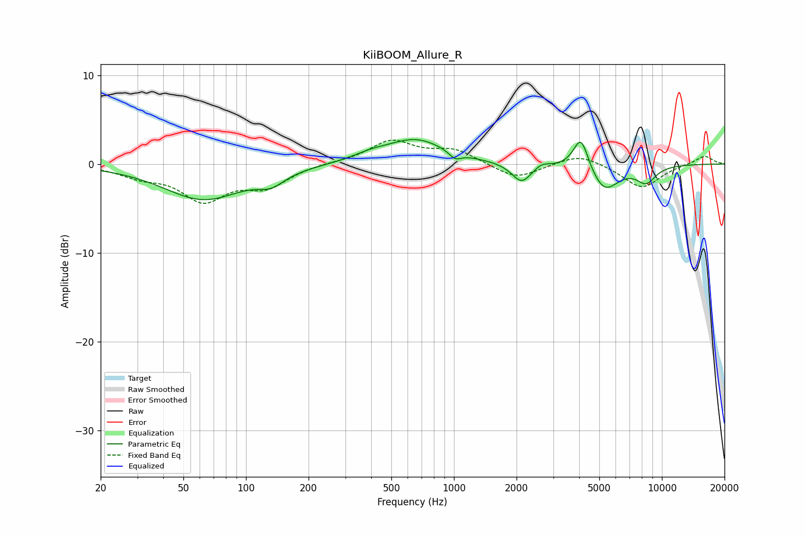

# KiiBOOM_Allure_R
See [usage instructions](https://github.com/jaakkopasanen/AutoEq#usage) for more options and info.

### Parametric EQs
Apply preamp of -2.8 dB when using parametric equalizer.

|   # | Type    |   Fc (Hz) |    Q |   Gain (dB) |
|-----|---------|-----------|------|-------------|
|   1 | Peaking |        62 | 0.74 |        -4   |
|   2 | Peaking |       132 | 2.17 |        -1.3 |
|   3 | Peaking |       395 | 1.65 |         0.6 |
|   4 | Peaking |       655 | 0.98 |         2.7 |
|   5 | Peaking |      1013 | 4.91 |        -0.8 |
|   6 | Peaking |      2116 | 3    |        -2.2 |
|   7 | Peaking |      2639 | 4.46 |         0.5 |
|   8 | Peaking |      4080 | 3.87 |         3.8 |
|   9 | Peaking |      5289 | 2.08 |        -3   |
|  10 | Peaking |      8395 | 2.78 |        -1.8 |

### Fixed Band EQs
When using fixed band (also called graphic) equalizer, apply preamp of **-2.8 dB** (if available) and set gains manually with these parameters.

|   # | Type    |   Fc (Hz) |    Q |   Gain (dB) |
|-----|---------|-----------|------|-------------|
|   1 | Peaking |        31 | 1.41 |        -1.2 |
|   2 | Peaking |        62 | 1.41 |        -3.8 |
|   3 | Peaking |       125 | 1.41 |        -2.3 |
|   4 | Peaking |       250 | 1.41 |         0.1 |
|   5 | Peaking |       500 | 1.41 |         2.5 |
|   6 | Peaking |      1000 | 1.41 |         1.5 |
|   7 | Peaking |      2000 | 1.41 |        -1.7 |
|   8 | Peaking |      4000 | 1.41 |         1.2 |
|   9 | Peaking |      8000 | 1.41 |        -2.7 |
|  10 | Peaking |     16000 | 1.41 |         1   |

### Graphs

