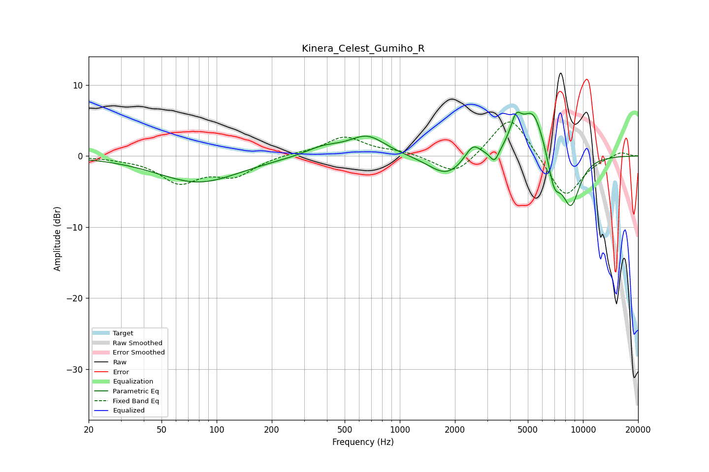

# Kinera_Celest_Gumiho_R
See [usage instructions](https://github.com/jaakkopasanen/AutoEq#usage) for more options and info.

### Parametric EQs
Apply preamp of -6.2 dB when using parametric equalizer.

|   # | Type    |   Fc (Hz) |    Q |   Gain (dB) |
|-----|---------|-----------|------|-------------|
|   1 | Peaking |        80 | 0.64 |        -3.7 |
|   2 | Peaking |       381 | 1.4  |         1.2 |
|   3 | Peaking |       665 | 1.41 |         2.8 |
|   4 | Peaking |      1803 | 1.45 |        -2.9 |
|   5 | Peaking |      2503 | 3.31 |         2.3 |
|   6 | Peaking |      3290 | 6    |        -1.8 |
|   7 | Peaking |      4307 | 4.55 |         3.5 |
|   8 | Peaking |      5349 | 2.08 |         6.8 |
|   9 | Peaking |      6962 | 3.79 |        -4.5 |
|  10 | Peaking |      8585 | 2.46 |        -7.1 |

### Fixed Band EQs
When using fixed band (also called graphic) equalizer, apply preamp of **-4.9 dB** (if available) and set gains manually with these parameters.

|   # | Type    |   Fc (Hz) |    Q |   Gain (dB) |
|-----|---------|-----------|------|-------------|
|   1 | Peaking |        31 | 1.41 |        -0.2 |
|   2 | Peaking |        62 | 1.41 |        -3.5 |
|   3 | Peaking |       125 | 1.41 |        -2.6 |
|   4 | Peaking |       250 | 1.41 |         0.3 |
|   5 | Peaking |       500 | 1.41 |         2.7 |
|   6 | Peaking |      1000 | 1.41 |         0.6 |
|   7 | Peaking |      2000 | 1.41 |        -2.9 |
|   8 | Peaking |      4000 | 1.41 |         6.1 |
|   9 | Peaking |      8000 | 1.41 |        -6.1 |
|  10 | Peaking |     16000 | 1.41 |         0.7 |

### Graphs

