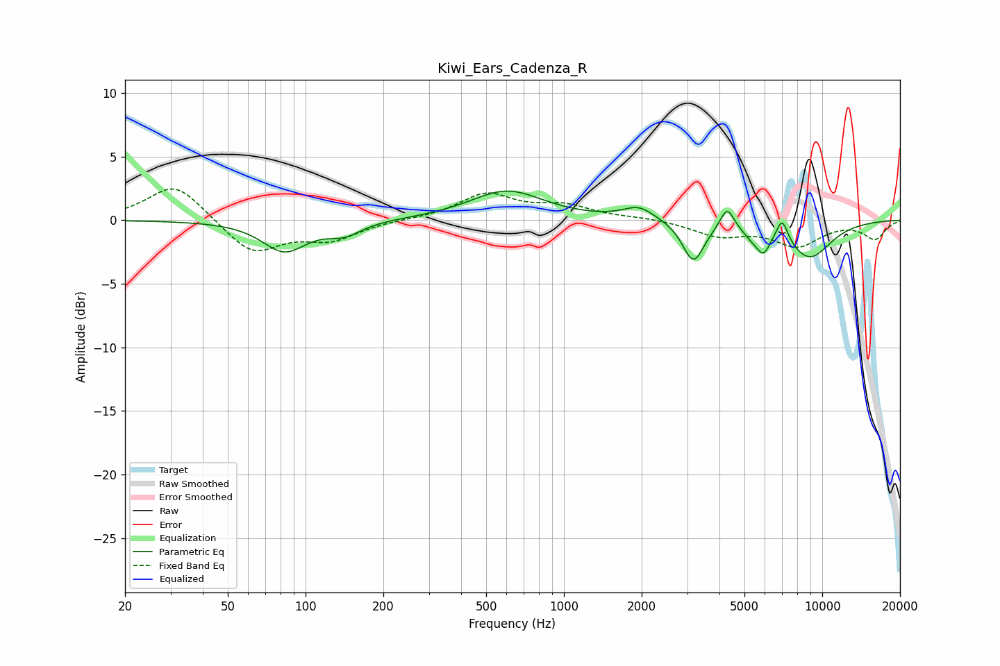

# Kiwi_Ears_Cadenza_R
See [usage instructions](https://github.com/jaakkopasanen/AutoEq#usage) for more options and info.

### Parametric EQs
Apply preamp of -2.4 dB when using parametric equalizer.

|   # | Type    |   Fc (Hz) |    Q |   Gain (dB) |
|-----|---------|-----------|------|-------------|
|   1 | Peaking |        83 | 1.66 |        -2.4 |
|   2 | Peaking |       141 | 2.14 |        -1   |
|   3 | Peaking |       601 | 1    |         2.3 |
|   4 | Peaking |      1950 | 2.34 |         1   |
|   5 | Peaking |      3171 | 3.4  |        -3.2 |
|   6 | Peaking |      4285 | 5.31 |         1.7 |
|   7 | Peaking |      5373 | 3.63 |        -0.7 |
|   8 | Peaking |      5927 | 5.14 |        -1.6 |
|   9 | Peaking |      6996 | 5.99 |         1.8 |
|  10 | Peaking |      8919 | 1.46 |        -2.9 |

### Fixed Band EQs
When using fixed band (also called graphic) equalizer, apply preamp of **-2.5 dB** (if available) and set gains manually with these parameters.

|   # | Type    |   Fc (Hz) |    Q |   Gain (dB) |
|-----|---------|-----------|------|-------------|
|   1 | Peaking |        31 | 1.41 |         3   |
|   2 | Peaking |        62 | 1.41 |        -2.7 |
|   3 | Peaking |       125 | 1.41 |        -1.4 |
|   4 | Peaking |       250 | 1.41 |         0   |
|   5 | Peaking |       500 | 1.41 |         2   |
|   6 | Peaking |      1000 | 1.41 |         1   |
|   7 | Peaking |      2000 | 1.41 |         0.2 |
|   8 | Peaking |      4000 | 1.41 |        -1.1 |
|   9 | Peaking |      8000 | 1.41 |        -1.9 |
|  10 | Peaking |     16000 | 1.41 |        -1.4 |

### Graphs

