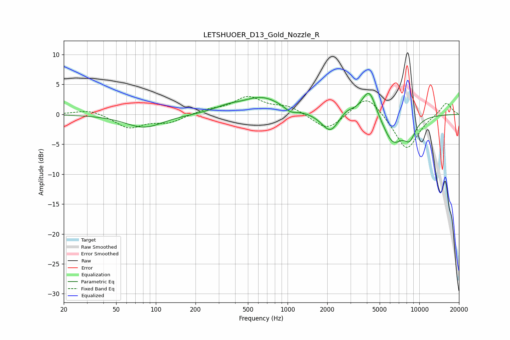

# LETSHUOER_D13_Gold_Nozzle_R
See [usage instructions](https://github.com/jaakkopasanen/AutoEq#usage) for more options and info.

### Parametric EQs
Apply preamp of -3.6 dB when using parametric equalizer.

|   # | Type    |   Fc (Hz) |    Q |   Gain (dB) |
|-----|---------|-----------|------|-------------|
|   1 | Peaking |        82 | 1    |        -2.2 |
|   2 | Peaking |       345 | 1.39 |         0.7 |
|   3 | Peaking |       644 | 0.91 |         2.8 |
|   4 | Peaking |      1051 | 3.04 |        -0.8 |
|   5 | Peaking |      2106 | 2.21 |        -2.8 |
|   6 | Peaking |      2203 | 1.92 |        -0.5 |
|   7 | Peaking |      2794 | 2.36 |         1.2 |
|   8 | Peaking |      4160 | 2.56 |         4.9 |
|   9 | Peaking |      6299 | 1.71 |        -4.8 |
|  10 | Peaking |      8461 | 2.98 |        -2.9 |

### Fixed Band EQs
When using fixed band (also called graphic) equalizer, apply preamp of **-3.1 dB** (if available) and set gains manually with these parameters.

|   # | Type    |   Fc (Hz) |    Q |   Gain (dB) |
|-----|---------|-----------|------|-------------|
|   1 | Peaking |        31 | 1.41 |         0.9 |
|   2 | Peaking |        62 | 1.41 |        -2.2 |
|   3 | Peaking |       125 | 1.41 |        -1.3 |
|   4 | Peaking |       250 | 1.41 |         0.7 |
|   5 | Peaking |       500 | 1.41 |         2.8 |
|   6 | Peaking |      1000 | 1.41 |         1.3 |
|   7 | Peaking |      2000 | 1.41 |        -2.8 |
|   8 | Peaking |      4000 | 1.41 |         3.6 |
|   9 | Peaking |      8000 | 1.41 |        -6.1 |
|  10 | Peaking |     16000 | 1.41 |         2.1 |

### Graphs

