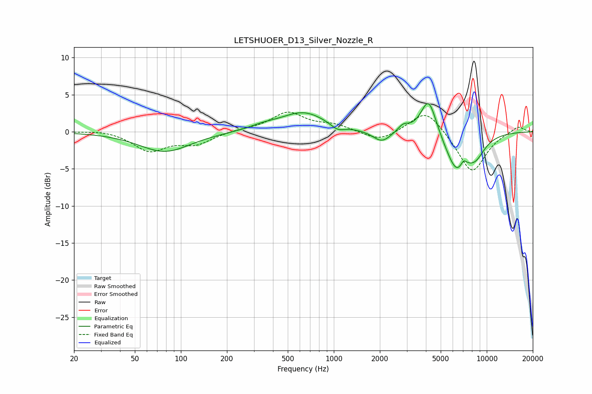

# LETSHUOER_D13_Silver_Nozzle_R
See [usage instructions](https://github.com/jaakkopasanen/AutoEq#usage) for more options and info.

### Parametric EQs
Apply preamp of -3.9 dB when using parametric equalizer.

|   # | Type    |   Fc (Hz) |    Q |   Gain (dB) |
|-----|---------|-----------|------|-------------|
|   1 | Peaking |        78 | 0.85 |        -2.7 |
|   2 | Peaking |       346 | 1.54 |         0.5 |
|   3 | Peaking |       632 | 0.96 |         2.6 |
|   4 | Peaking |      1056 | 3.16 |        -0.8 |
|   5 | Peaking |      2061 | 2.39 |        -1.6 |
|   6 | Peaking |      2843 | 4.03 |         0.9 |
|   7 | Peaking |      4170 | 2.7  |         5.1 |
|   8 | Peaking |      6378 | 1.81 |        -5.1 |
|   9 | Peaking |      7048 | 6    |         1.2 |
|  10 | Peaking |      8450 | 2.05 |        -2.3 |

### Fixed Band EQs
When using fixed band (also called graphic) equalizer, apply preamp of **-2.7 dB** (if available) and set gains manually with these parameters.

|   # | Type    |   Fc (Hz) |    Q |   Gain (dB) |
|-----|---------|-----------|------|-------------|
|   1 | Peaking |        31 | 1.41 |         0.3 |
|   2 | Peaking |        62 | 1.41 |        -2.5 |
|   3 | Peaking |       125 | 1.41 |        -1.5 |
|   4 | Peaking |       250 | 1.41 |         0.3 |
|   5 | Peaking |       500 | 1.41 |         2.5 |
|   6 | Peaking |      1000 | 1.41 |         0.8 |
|   7 | Peaking |      2000 | 1.41 |        -1.4 |
|   8 | Peaking |      4000 | 1.41 |         3.2 |
|   9 | Peaking |      8000 | 1.41 |        -5.6 |
|  10 | Peaking |     16000 | 1.41 |         0.9 |

### Graphs

