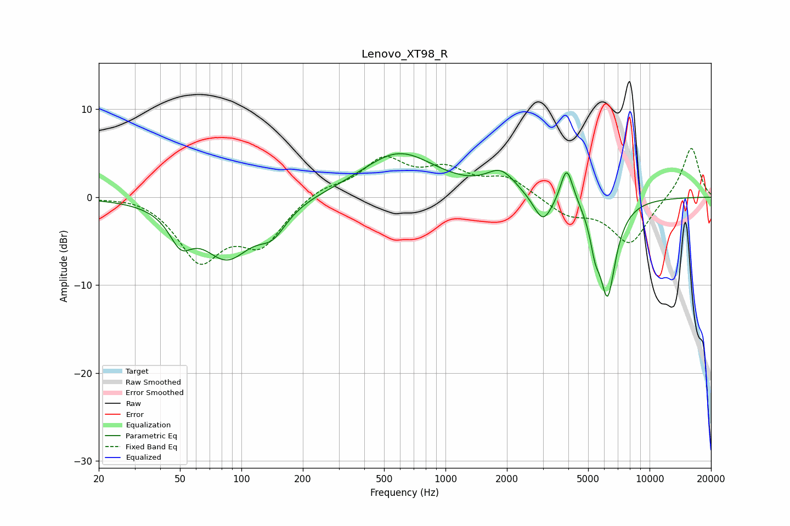

# Lenovo_XT98_R
See [usage instructions](https://github.com/jaakkopasanen/AutoEq#usage) for more options and info.

### Parametric EQs
Apply preamp of -5.0 dB when using parametric equalizer.

|   # | Type    |   Fc (Hz) |    Q |   Gain (dB) |
|-----|---------|-----------|------|-------------|
|   1 | Peaking |        50 | 2.56 |        -3.4 |
|   2 | Peaking |        85 | 1.14 |        -6.5 |
|   3 | Peaking |       142 | 2.04 |        -2.7 |
|   4 | Peaking |       591 | 0.77 |         5   |
|   5 | Peaking |      1870 | 1.97 |         2.5 |
|   6 | Peaking |      3006 | 3.06 |        -3.2 |
|   7 | Peaking |      3914 | 4.93 |         3.7 |
|   8 | Peaking |      4124 | 3.36 |         0.7 |
|   9 | Peaking |      5407 | 5.93 |        -2.8 |
|  10 | Peaking |      6223 | 3.32 |       -10.9 |

### Fixed Band EQs
When using fixed band (also called graphic) equalizer, apply preamp of **-5.6 dB** (if available) and set gains manually with these parameters.

|   # | Type    |   Fc (Hz) |    Q |   Gain (dB) |
|-----|---------|-----------|------|-------------|
|   1 | Peaking |        31 | 1.41 |         0.4 |
|   2 | Peaking |        62 | 1.41 |        -6.9 |
|   3 | Peaking |       125 | 1.41 |        -4.9 |
|   4 | Peaking |       250 | 1.41 |         1.2 |
|   5 | Peaking |       500 | 1.41 |         4.1 |
|   6 | Peaking |      1000 | 1.41 |         2.7 |
|   7 | Peaking |      2000 | 1.41 |         2.1 |
|   8 | Peaking |      4000 | 1.41 |        -1.9 |
|   9 | Peaking |      8000 | 1.41 |        -5.3 |
|  10 | Peaking |     16000 | 1.41 |         5.8 |

### Graphs

