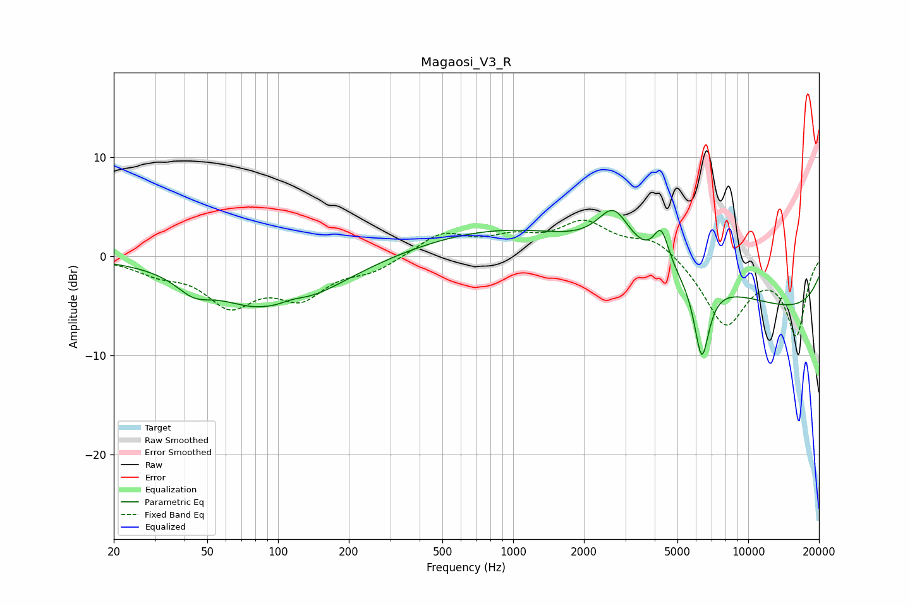

# Magaosi_V3_R
See [usage instructions](https://github.com/jaakkopasanen/AutoEq#usage) for more options and info.

### Parametric EQs
Apply preamp of -4.7 dB when using parametric equalizer.

|   # | Type    |   Fc (Hz) |    Q |   Gain (dB) |
|-----|---------|-----------|------|-------------|
|   1 | Peaking |        44 | 1.95 |        -1.6 |
|   2 | Peaking |        88 | 2.67 |         0.2 |
|   3 | Peaking |        99 | 0.62 |        -6   |
|   4 | Peaking |       113 | 1.94 |         1.1 |
|   5 | Peaking |      2334 | 0.18 |         4.3 |
|   6 | Peaking |      2680 | 2.04 |         4.3 |
|   7 | Peaking |      4266 | 4.36 |         3.6 |
|   8 | Peaking |      4268 | 5.19 |        -0   |
|   9 | Peaking |      6343 | 4.23 |        -7.8 |
|  10 | Peaking |      9819 | 0.18 |        -6.3 |

### Fixed Band EQs
When using fixed band (also called graphic) equalizer, apply preamp of **-3.8 dB** (if available) and set gains manually with these parameters.

|   # | Type    |   Fc (Hz) |    Q |   Gain (dB) |
|-----|---------|-----------|------|-------------|
|   1 | Peaking |        31 | 1.41 |        -1.3 |
|   2 | Peaking |        62 | 1.41 |        -4.5 |
|   3 | Peaking |       125 | 1.41 |        -3.6 |
|   4 | Peaking |       250 | 1.41 |        -1.3 |
|   5 | Peaking |       500 | 1.41 |         2.3 |
|   6 | Peaking |      1000 | 1.41 |         1.6 |
|   7 | Peaking |      2000 | 1.41 |         3.2 |
|   8 | Peaking |      4000 | 1.41 |         1.9 |
|   9 | Peaking |      8000 | 1.41 |        -6.9 |
|  10 | Peaking |     16000 | 1.41 |        -7.7 |

### Graphs

