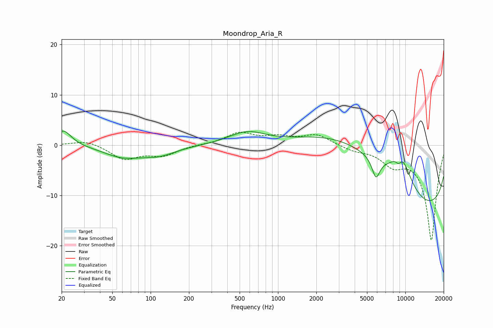

# Moondrop_Aria_R
See [usage instructions](https://github.com/jaakkopasanen/AutoEq#usage) for more options and info.

### Parametric EQs
Apply preamp of -2.9 dB when using parametric equalizer.

|   # | Type    |   Fc (Hz) |    Q |   Gain (dB) |
|-----|---------|-----------|------|-------------|
|   1 | Peaking |        21 | 2.27 |         3.1 |
|   2 | Peaking |        60 | 0.96 |        -2.1 |
|   3 | Peaking |       116 | 1.04 |        -1.7 |
|   4 | Peaking |       573 | 0.98 |         2.6 |
|   5 | Peaking |      3313 | 0.33 |         6   |
|   6 | Peaking |      5466 | 0.29 |         8.1 |
|   7 | Peaking |      5873 | 4.49 |        -3.9 |
|   8 | Peaking |      8855 | 5.39 |        -1.6 |
|   9 | Peaking |      9265 | 1.6  |         6.5 |
|  10 | Peaking |      9566 | 0.18 |       -18.7 |

### Fixed Band EQs
When using fixed band (also called graphic) equalizer, apply preamp of **-2.7 dB** (if available) and set gains manually with these parameters.

|   # | Type    |   Fc (Hz) |    Q |   Gain (dB) |
|-----|---------|-----------|------|-------------|
|   1 | Peaking |        31 | 1.41 |         1   |
|   2 | Peaking |        62 | 1.41 |        -2.7 |
|   3 | Peaking |       125 | 1.41 |        -1.9 |
|   4 | Peaking |       250 | 1.41 |         0.1 |
|   5 | Peaking |       500 | 1.41 |         2.3 |
|   6 | Peaking |      1000 | 1.41 |         1.4 |
|   7 | Peaking |      2000 | 1.41 |         2.1 |
|   8 | Peaking |      4000 | 1.41 |        -0.9 |
|   9 | Peaking |      8000 | 1.41 |        -3.1 |
|  10 | Peaking |     16000 | 1.41 |       -18.9 |

### Graphs

