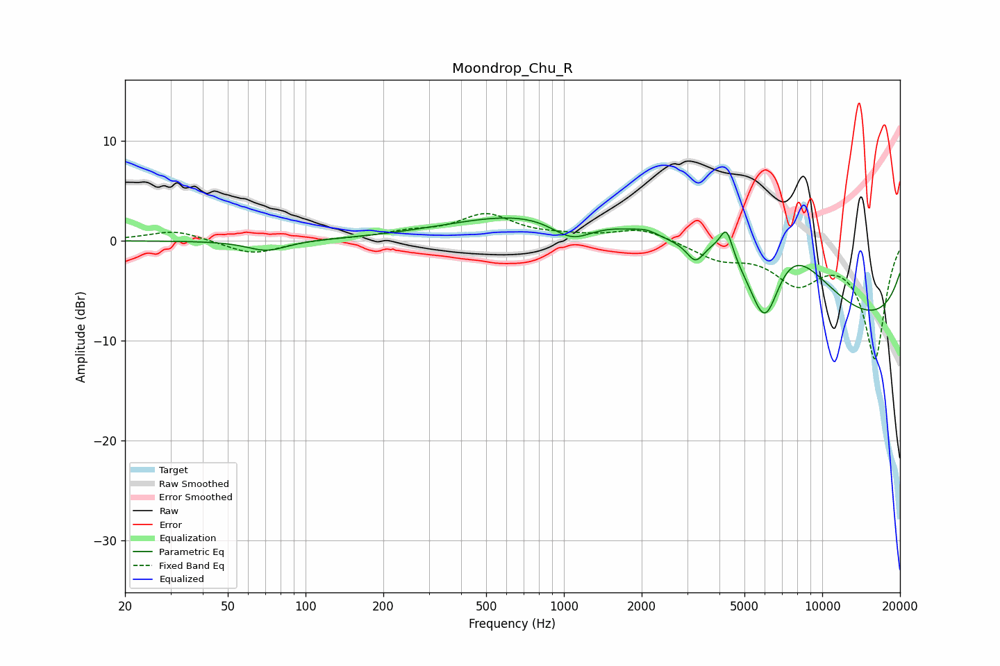

# Moondrop_Chu_R
See [usage instructions](https://github.com/jaakkopasanen/AutoEq#usage) for more options and info.

### Parametric EQs
Apply preamp of -2.4 dB when using parametric equalizer.

|   # | Type    |   Fc (Hz) |    Q |   Gain (dB) |
|-----|---------|-----------|------|-------------|
|   1 | Peaking |        71 | 1.88 |        -1.1 |
|   2 | Peaking |      1074 | 1.67 |        -2.4 |
|   3 | Peaking |      2073 | 0.21 |         5.1 |
|   4 | Peaking |      2098 | 3.32 |         0.4 |
|   5 | Peaking |      3230 | 4.51 |        -1.7 |
|   6 | Peaking |      3806 | 3.43 |         0.6 |
|   7 | Peaking |      4261 | 5.71 |         2.9 |
|   8 | Peaking |      6006 | 2.05 |        -9.2 |
|   9 | Peaking |      7037 | 0.84 |         7.6 |
|  10 | Peaking |     10000 | 0.18 |        -9.4 |

### Fixed Band EQs
When using fixed band (also called graphic) equalizer, apply preamp of **-2.8 dB** (if available) and set gains manually with these parameters.

|   # | Type    |   Fc (Hz) |    Q |   Gain (dB) |
|-----|---------|-----------|------|-------------|
|   1 | Peaking |        31 | 1.41 |         1.1 |
|   2 | Peaking |        62 | 1.41 |        -1.4 |
|   3 | Peaking |       125 | 1.41 |         0.2 |
|   4 | Peaking |       250 | 1.41 |         0.7 |
|   5 | Peaking |       500 | 1.41 |         2.5 |
|   6 | Peaking |      1000 | 1.41 |         0.3 |
|   7 | Peaking |      2000 | 1.41 |         1.3 |
|   8 | Peaking |      4000 | 1.41 |        -1.6 |
|   9 | Peaking |      8000 | 1.41 |        -3.8 |
|  10 | Peaking |     16000 | 1.41 |       -11.7 |

### Graphs

