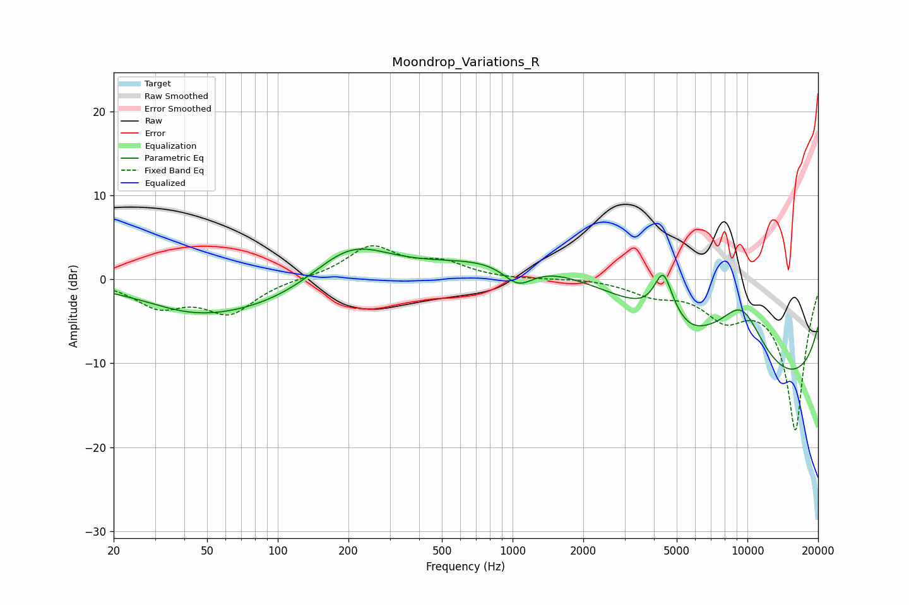

# Moondrop_Variations_R
See [usage instructions](https://github.com/jaakkopasanen/AutoEq#usage) for more options and info.

### Parametric EQs
Apply preamp of -3.7 dB when using parametric equalizer.

|   # | Type    |   Fc (Hz) |    Q |   Gain (dB) |
|-----|---------|-----------|------|-------------|
|   1 | Peaking |        44 | 0.86 |        -1.3 |
|   2 | Peaking |        48 | 1.61 |         0.1 |
|   3 | Peaking |        90 | 0.32 |        -4.1 |
|   4 | Peaking |       203 | 0.78 |         6   |
|   5 | Peaking |      1057 | 2.17 |        -2.6 |
|   6 | Peaking |      3083 | 0.2  |         7.3 |
|   7 | Peaking |      4383 | 3.61 |         5.4 |
|   8 | Peaking |      5734 | 2.3  |        -0.7 |
|   9 | Peaking |      9458 | 1.24 |         7   |
|  10 | Peaking |     10000 | 0.18 |       -15.8 |

### Fixed Band EQs
When using fixed band (also called graphic) equalizer, apply preamp of **-4.1 dB** (if available) and set gains manually with these parameters.

|   # | Type    |   Fc (Hz) |    Q |   Gain (dB) |
|-----|---------|-----------|------|-------------|
|   1 | Peaking |        31 | 1.41 |        -3   |
|   2 | Peaking |        62 | 1.41 |        -3.8 |
|   3 | Peaking |       125 | 1.41 |         0.1 |
|   4 | Peaking |       250 | 1.41 |         3.8 |
|   5 | Peaking |       500 | 1.41 |         1.8 |
|   6 | Peaking |      1000 | 1.41 |        -0.1 |
|   7 | Peaking |      2000 | 1.41 |         0.2 |
|   8 | Peaking |      4000 | 1.41 |        -1.5 |
|   9 | Peaking |      8000 | 1.41 |        -3.7 |
|  10 | Peaking |     16000 | 1.41 |       -17.9 |

### Graphs

