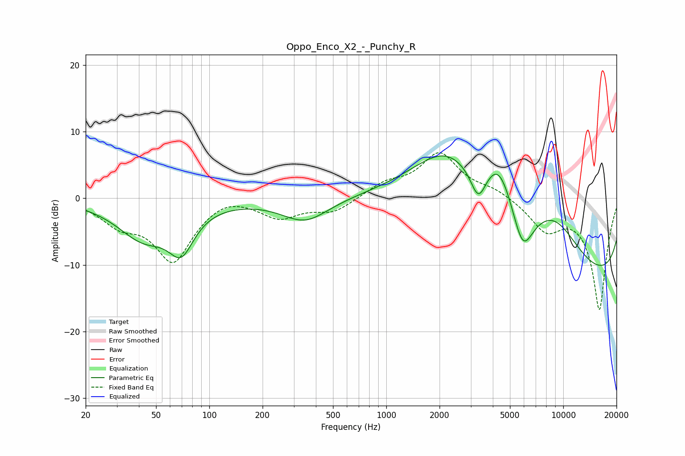

# Oppo_Enco_X2_-_Punchy_R
See [usage instructions](https://github.com/jaakkopasanen/AutoEq#usage) for more options and info.

### Parametric EQs
Apply preamp of -6.5 dB when using parametric equalizer.

|   # | Type    |   Fc (Hz) |    Q |   Gain (dB) |
|-----|---------|-----------|------|-------------|
|   1 | Peaking |        42 | 0.94 |        -5.6 |
|   2 | Peaking |        69 | 1.98 |        -5.8 |
|   3 | Peaking |       348 | 1.07 |        -3.5 |
|   4 | Peaking |      2200 | 0.56 |        11.2 |
|   5 | Peaking |      2822 | 0.52 |         2.6 |
|   6 | Peaking |      3316 | 3.21 |        -4.8 |
|   7 | Peaking |      4342 | 1.71 |         6.3 |
|   8 | Peaking |      5904 | 2.3  |        -6.9 |
|   9 | Peaking |      8885 | 0.54 |        13.3 |
|  10 | Peaking |      9885 | 0.18 |       -18.8 |

### Fixed Band EQs
When using fixed band (also called graphic) equalizer, apply preamp of **-6.9 dB** (if available) and set gains manually with these parameters.

|   # | Type    |   Fc (Hz) |    Q |   Gain (dB) |
|-----|---------|-----------|------|-------------|
|   1 | Peaking |        31 | 1.41 |        -3.2 |
|   2 | Peaking |        62 | 1.41 |        -9.2 |
|   3 | Peaking |       125 | 1.41 |         1.1 |
|   4 | Peaking |       250 | 1.41 |        -2.7 |
|   5 | Peaking |       500 | 1.41 |        -2   |
|   6 | Peaking |      1000 | 1.41 |         1.9 |
|   7 | Peaking |      2000 | 1.41 |         6.6 |
|   8 | Peaking |      4000 | 1.41 |         1.2 |
|   9 | Peaking |      8000 | 1.41 |        -4.3 |
|  10 | Peaking |     16000 | 1.41 |       -16.7 |

### Graphs

