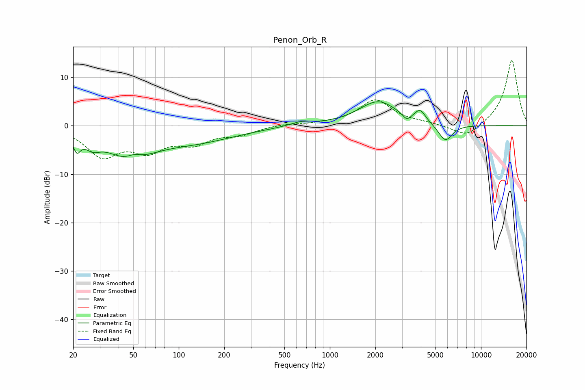

# Penon_Orb_R
See [usage instructions](https://github.com/jaakkopasanen/AutoEq#usage) for more options and info.

### Parametric EQs
Apply preamp of -5.0 dB when using parametric equalizer.

|   # | Type    |   Fc (Hz) |    Q |   Gain (dB) |
|-----|---------|-----------|------|-------------|
|   1 | Peaking |        21 | 5.95 |        -3   |
|   2 | Peaking |        27 | 2.78 |        -2.2 |
|   3 | Peaking |        47 | 0.94 |        -5.9 |
|   4 | Peaking |        51 | 2.83 |         1.4 |
|   5 | Peaking |       127 | 0.51 |        -3   |
|   6 | Peaking |       643 | 1.89 |         0.9 |
|   7 | Peaking |      2086 | 1.09 |         5   |
|   8 | Peaking |      3224 | 5.02 |        -1.4 |
|   9 | Peaking |      3956 | 4    |         2.4 |
|  10 | Peaking |      5811 | 2.99 |        -3.6 |

### Fixed Band EQs
When using fixed band (also called graphic) equalizer, apply preamp of **-13.6 dB** (if available) and set gains manually with these parameters.

|   # | Type    |   Fc (Hz) |    Q |   Gain (dB) |
|-----|---------|-----------|------|-------------|
|   1 | Peaking |        31 | 1.41 |        -5.9 |
|   2 | Peaking |        62 | 1.41 |        -4.4 |
|   3 | Peaking |       125 | 1.41 |        -3.1 |
|   4 | Peaking |       250 | 1.41 |        -1.6 |
|   5 | Peaking |       500 | 1.41 |         0.4 |
|   6 | Peaking |      1000 | 1.41 |         0.3 |
|   7 | Peaking |      2000 | 1.41 |         5.2 |
|   8 | Peaking |      4000 | 1.41 |         0.4 |
|   9 | Peaking |      8000 | 1.41 |        -2.6 |
|  10 | Peaking |     16000 | 1.41 |        13.7 |

### Graphs

