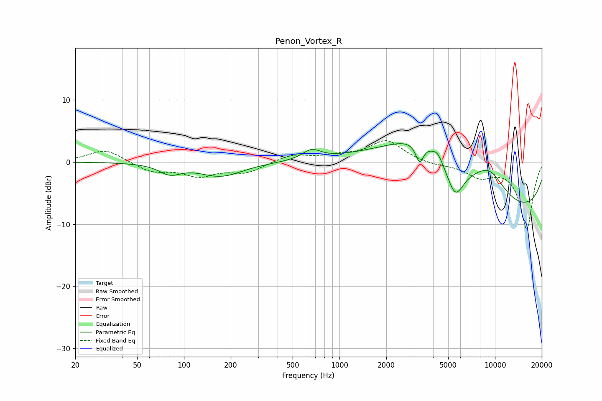

# Penon_Vortex_R
See [usage instructions](https://github.com/jaakkopasanen/AutoEq#usage) for more options and info.

### Parametric EQs
Apply preamp of -3.1 dB when using parametric equalizer.

|   # | Type    |   Fc (Hz) |    Q |   Gain (dB) |
|-----|---------|-----------|------|-------------|
|   1 | Peaking |        81 | 2.08 |        -1.6 |
|   2 | Peaking |       173 | 1.02 |        -2.3 |
|   3 | Peaking |       662 | 2.48 |         1.6 |
|   4 | Peaking |      3236 | 5.94 |         0.1 |
|   5 | Peaking |      3275 | 5.57 |        -3.3 |
|   6 | Peaking |      3716 | 0.46 |        10.5 |
|   7 | Peaking |      4272 | 5.74 |         0.8 |
|   8 | Peaking |      5529 | 2.32 |        -6.1 |
|   9 | Peaking |      9264 | 1.3  |         3.6 |
|  10 | Peaking |      9637 | 0.18 |        -9   |

### Fixed Band EQs
When using fixed band (also called graphic) equalizer, apply preamp of **-3.5 dB** (if available) and set gains manually with these parameters.

|   # | Type    |   Fc (Hz) |    Q |   Gain (dB) |
|-----|---------|-----------|------|-------------|
|   1 | Peaking |        31 | 1.41 |         2.1 |
|   2 | Peaking |        62 | 1.41 |        -1.5 |
|   3 | Peaking |       125 | 1.41 |        -2   |
|   4 | Peaking |       250 | 1.41 |        -1.6 |
|   5 | Peaking |       500 | 1.41 |         1.2 |
|   6 | Peaking |      1000 | 1.41 |         0.8 |
|   7 | Peaking |      2000 | 1.41 |         3.4 |
|   8 | Peaking |      4000 | 1.41 |        -0.4 |
|   9 | Peaking |      8000 | 1.41 |        -2.1 |
|  10 | Peaking |     16000 | 1.41 |       -10.8 |

### Graphs

