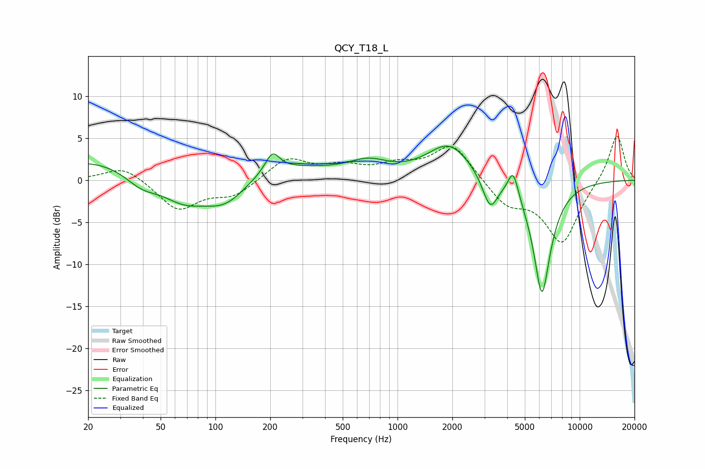

# QCY_T18_L
See [usage instructions](https://github.com/jaakkopasanen/AutoEq#usage) for more options and info.

### Parametric EQs
Apply preamp of -4.1 dB when using parametric equalizer.

|   # | Type    |   Fc (Hz) |    Q |   Gain (dB) |
|-----|---------|-----------|------|-------------|
|   1 | Peaking |        39 | 1.4  |        -2.3 |
|   2 | Peaking |        61 | 0.18 |         3.7 |
|   3 | Peaking |        66 | 1.02 |        -4   |
|   4 | Peaking |       113 | 1.05 |        -4.4 |
|   5 | Peaking |       206 | 3.63 |         2.3 |
|   6 | Peaking |       692 | 1.31 |         1.6 |
|   7 | Peaking |      1922 | 1.16 |         4.3 |
|   8 | Peaking |      3223 | 3.37 |        -3.9 |
|   9 | Peaking |      4315 | 4.99 |         3.2 |
|  10 | Peaking |      6206 | 2.75 |       -13.6 |

### Fixed Band EQs
When using fixed band (also called graphic) equalizer, apply preamp of **-5.3 dB** (if available) and set gains manually with these parameters.

|   # | Type    |   Fc (Hz) |    Q |   Gain (dB) |
|-----|---------|-----------|------|-------------|
|   1 | Peaking |        31 | 1.41 |         1.8 |
|   2 | Peaking |        62 | 1.41 |        -3.5 |
|   3 | Peaking |       125 | 1.41 |        -1.8 |
|   4 | Peaking |       250 | 1.41 |         2.6 |
|   5 | Peaking |       500 | 1.41 |         1.4 |
|   6 | Peaking |      1000 | 1.41 |         1.5 |
|   7 | Peaking |      2000 | 1.41 |         4.3 |
|   8 | Peaking |      4000 | 1.41 |        -2.8 |
|   9 | Peaking |      8000 | 1.41 |        -7.4 |
|  10 | Peaking |     16000 | 1.41 |         5.7 |

### Graphs

