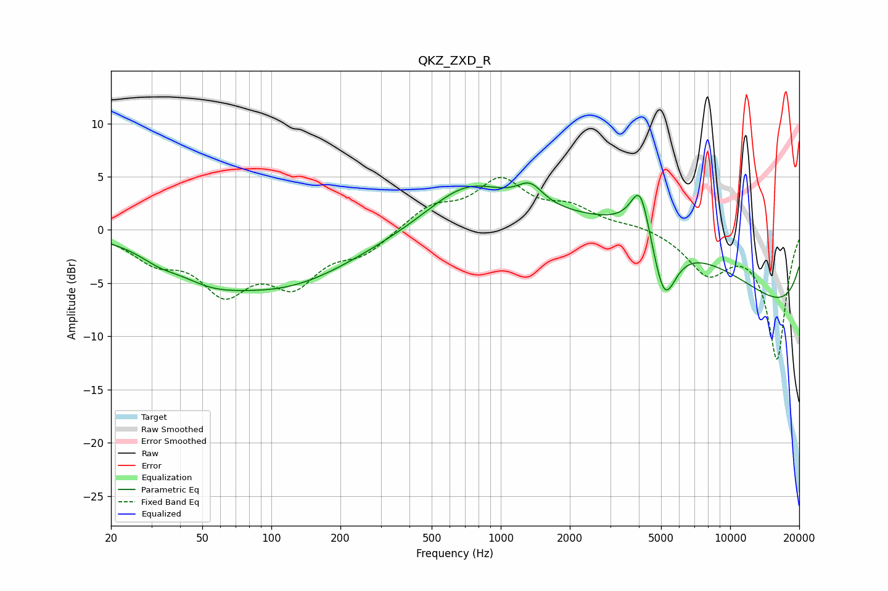

# QKZ_ZXD_R
See [usage instructions](https://github.com/jaakkopasanen/AutoEq#usage) for more options and info.

### Parametric EQs
Apply preamp of -4.5 dB when using parametric equalizer.

|   # | Type    |   Fc (Hz) |    Q |   Gain (dB) |
|-----|---------|-----------|------|-------------|
|   1 | Peaking |        32 | 1.64 |        -0.9 |
|   2 | Peaking |        53 | 1.04 |        -1.7 |
|   3 | Peaking |       109 | 0.44 |        -5.1 |
|   4 | Peaking |       712 | 0.82 |         3.9 |
|   5 | Peaking |      1343 | 2.5  |         1.9 |
|   6 | Peaking |      3521 | 1.45 |         0.5 |
|   7 | Peaking |      4060 | 3.37 |         4.8 |
|   8 | Peaking |      5163 | 2.69 |        -6   |
|   9 | Peaking |      5242 | 0.27 |         8.5 |
|  10 | Peaking |     10000 | 0.18 |       -10.7 |

### Fixed Band EQs
When using fixed band (also called graphic) equalizer, apply preamp of **-5.0 dB** (if available) and set gains manually with these parameters.

|   # | Type    |   Fc (Hz) |    Q |   Gain (dB) |
|-----|---------|-----------|------|-------------|
|   1 | Peaking |        31 | 1.41 |        -2.4 |
|   2 | Peaking |        62 | 1.41 |        -5.2 |
|   3 | Peaking |       125 | 1.41 |        -4.5 |
|   4 | Peaking |       250 | 1.41 |        -2   |
|   5 | Peaking |       500 | 1.41 |         2.1 |
|   6 | Peaking |      1000 | 1.41 |         4.4 |
|   7 | Peaking |      2000 | 1.41 |         1.8 |
|   8 | Peaking |      4000 | 1.41 |         0.5 |
|   9 | Peaking |      8000 | 1.41 |        -3.8 |
|  10 | Peaking |     16000 | 1.41 |       -12.1 |

### Graphs

