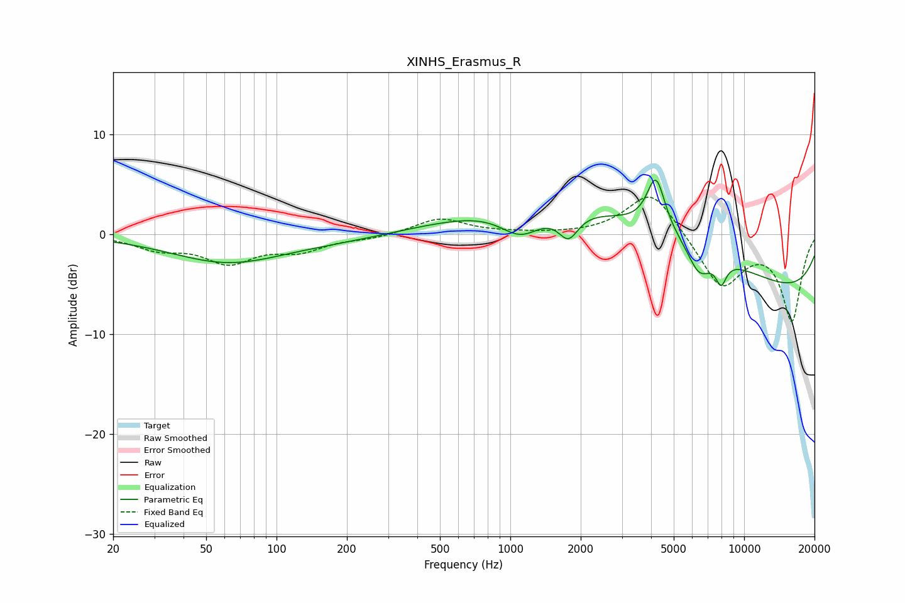

# XINHS_Erasmus_R
See [usage instructions](https://github.com/jaakkopasanen/AutoEq#usage) for more options and info.

### Parametric EQs
Apply preamp of -5.5 dB when using parametric equalizer.

|   # | Type    |   Fc (Hz) |    Q |   Gain (dB) |
|-----|---------|-----------|------|-------------|
|   1 | Peaking |        62 | 0.57 |        -2.8 |
|   2 | Peaking |       195 | 0.68 |        -0.4 |
|   3 | Peaking |      1109 | 1.54 |        -2.9 |
|   4 | Peaking |      1772 | 3.31 |        -2.6 |
|   5 | Peaking |      2338 | 0.23 |         2.3 |
|   6 | Peaking |      3475 | 0.26 |         4.1 |
|   7 | Peaking |      4197 | 3.59 |         5.4 |
|   8 | Peaking |      6419 | 2.77 |        -2.8 |
|   9 | Peaking |      7972 | 5.81 |        -2.2 |
|  10 | Peaking |      9889 | 0.18 |        -6.7 |

### Fixed Band EQs
When using fixed band (also called graphic) equalizer, apply preamp of **-3.8 dB** (if available) and set gains manually with these parameters.

|   # | Type    |   Fc (Hz) |    Q |   Gain (dB) |
|-----|---------|-----------|------|-------------|
|   1 | Peaking |        31 | 1.41 |        -1.3 |
|   2 | Peaking |        62 | 1.41 |        -2.6 |
|   3 | Peaking |       125 | 1.41 |        -1.5 |
|   4 | Peaking |       250 | 1.41 |        -0.4 |
|   5 | Peaking |       500 | 1.41 |         1.6 |
|   6 | Peaking |      1000 | 1.41 |         0.1 |
|   7 | Peaking |      2000 | 1.41 |        -0   |
|   8 | Peaking |      4000 | 1.41 |         4.5 |
|   9 | Peaking |      8000 | 1.41 |        -5.3 |
|  10 | Peaking |     16000 | 1.41 |        -8.6 |

### Graphs

