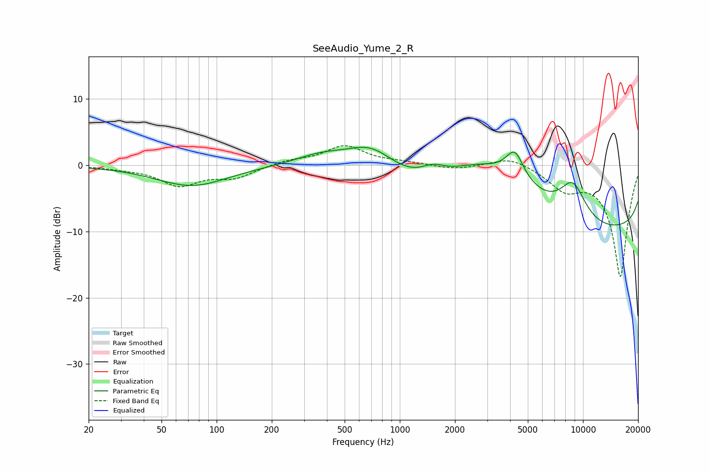

# SeeAudio_Yume_2_R
See [usage instructions](https://github.com/jaakkopasanen/AutoEq#usage) for more options and info.

### Parametric EQs
Apply preamp of -2.8 dB when using parametric equalizer.

|   # | Type    |   Fc (Hz) |    Q |   Gain (dB) |
|-----|---------|-----------|------|-------------|
|   1 | Peaking |        73 | 0.73 |        -3.1 |
|   2 | Peaking |       371 | 1.01 |         1.4 |
|   3 | Peaking |       694 | 1.13 |         3.1 |
|   4 | Peaking |      1395 | 0.7  |        -4.3 |
|   5 | Peaking |      1509 | 1.93 |         1.9 |
|   6 | Peaking |      2856 | 0.63 |         3.7 |
|   7 | Peaking |      4246 | 2.86 |         4.3 |
|   8 | Peaking |      5463 | 0.18 |        10.4 |
|   9 | Peaking |      8808 | 1.77 |         5.6 |
|  10 | Peaking |      9387 | 0.18 |       -18.9 |

### Fixed Band EQs
When using fixed band (also called graphic) equalizer, apply preamp of **-3.1 dB** (if available) and set gains manually with these parameters.

|   # | Type    |   Fc (Hz) |    Q |   Gain (dB) |
|-----|---------|-----------|------|-------------|
|   1 | Peaking |        31 | 1.41 |        -0.3 |
|   2 | Peaking |        62 | 1.41 |        -2.9 |
|   3 | Peaking |       125 | 1.41 |        -1.7 |
|   4 | Peaking |       250 | 1.41 |         0.7 |
|   5 | Peaking |       500 | 1.41 |         2.9 |
|   6 | Peaking |      1000 | 1.41 |         0.4 |
|   7 | Peaking |      2000 | 1.41 |        -0.6 |
|   8 | Peaking |      4000 | 1.41 |         1.4 |
|   9 | Peaking |      8000 | 1.41 |        -3.1 |
|  10 | Peaking |     16000 | 1.41 |       -16.8 |

### Graphs

