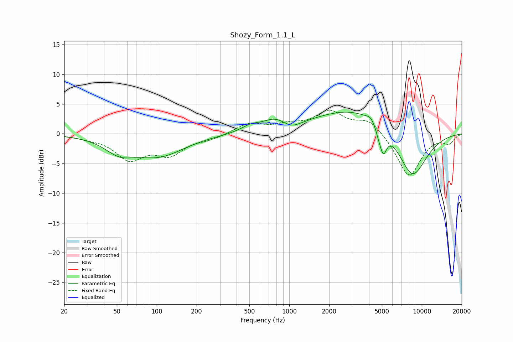

# Shozy_Form_1.1_L
See [usage instructions](https://github.com/jaakkopasanen/AutoEq#usage) for more options and info.

### Parametric EQs
Apply preamp of -3.7 dB when using parametric equalizer.

|   # | Type    |   Fc (Hz) |    Q |   Gain (dB) |
|-----|---------|-----------|------|-------------|
|   1 | Peaking |        52 | 1.3  |        -2.3 |
|   2 | Peaking |       104 | 0.74 |        -3.5 |
|   3 | Peaking |       512 | 1.95 |         1   |
|   4 | Peaking |       779 | 1.62 |         1.7 |
|   5 | Peaking |      1040 | 2.08 |        -1   |
|   6 | Peaking |      3273 | 0.45 |         4.5 |
|   7 | Peaking |      4113 | 4.48 |         0.8 |
|   8 | Peaking |      4755 | 5.98 |        -1.1 |
|   9 | Peaking |      5131 | 5.42 |        -3.6 |
|  10 | Peaking |      8445 | 1.11 |        -8.6 |

### Fixed Band EQs
When using fixed band (also called graphic) equalizer, apply preamp of **-4.1 dB** (if available) and set gains manually with these parameters.

|   # | Type    |   Fc (Hz) |    Q |   Gain (dB) |
|-----|---------|-----------|------|-------------|
|   1 | Peaking |        31 | 1.41 |        -0.5 |
|   2 | Peaking |        62 | 1.41 |        -4   |
|   3 | Peaking |       125 | 1.41 |        -3.1 |
|   4 | Peaking |       250 | 1.41 |        -0.8 |
|   5 | Peaking |       500 | 1.41 |         1.7 |
|   6 | Peaking |      1000 | 1.41 |         1.2 |
|   7 | Peaking |      2000 | 1.41 |         3.5 |
|   8 | Peaking |      4000 | 1.41 |         2.4 |
|   9 | Peaking |      8000 | 1.41 |        -7.3 |
|  10 | Peaking |     16000 | 1.41 |        -1.4 |

### Graphs

