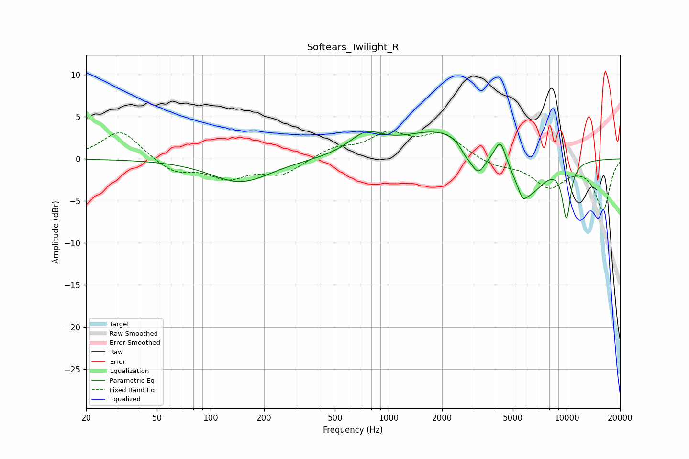

# Softears_Twilight_R
See [usage instructions](https://github.com/jaakkopasanen/AutoEq#usage) for more options and info.

### Parametric EQs
Apply preamp of -3.4 dB when using parametric equalizer.

|   # | Type    |   Fc (Hz) |    Q |   Gain (dB) |
|-----|---------|-----------|------|-------------|
|   1 | Peaking |       148 | 0.84 |        -2.8 |
|   2 | Peaking |       746 | 1.53 |         2.3 |
|   3 | Peaking |      2014 | 0.63 |         3.5 |
|   4 | Peaking |      2693 | 5.03 |        -0.8 |
|   5 | Peaking |      3170 | 3.17 |        -3.3 |
|   6 | Peaking |      4253 | 4.53 |         2.8 |
|   7 | Peaking |      5654 | 5.98 |        -1.3 |
|   8 | Peaking |      6090 | 1.49 |        -4.5 |
|   9 | Peaking |     10000 | 4.99 |        -4.1 |
|  10 | Peaking |     10000 | 5.66 |        -2.3 |

### Fixed Band EQs
When using fixed band (also called graphic) equalizer, apply preamp of **-3.4 dB** (if available) and set gains manually with these parameters.

|   # | Type    |   Fc (Hz) |    Q |   Gain (dB) |
|-----|---------|-----------|------|-------------|
|   1 | Peaking |        31 | 1.41 |         3.5 |
|   2 | Peaking |        62 | 1.41 |        -1.6 |
|   3 | Peaking |       125 | 1.41 |        -2.1 |
|   4 | Peaking |       250 | 1.41 |        -1.8 |
|   5 | Peaking |       500 | 1.41 |         1.2 |
|   6 | Peaking |      1000 | 1.41 |         2.7 |
|   7 | Peaking |      2000 | 1.41 |         2.8 |
|   8 | Peaking |      4000 | 1.41 |        -0.8 |
|   9 | Peaking |      8000 | 1.41 |        -3.2 |
|  10 | Peaking |     16000 | 1.41 |        -6   |

### Graphs

