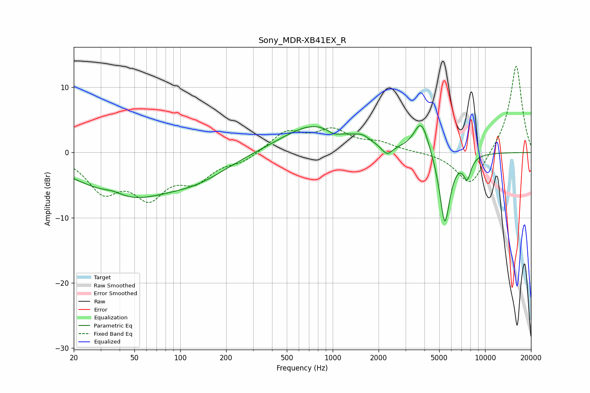

# Sony_MDR-XB41EX_R
See [usage instructions](https://github.com/jaakkopasanen/AutoEq#usage) for more options and info.

### Parametric EQs
Apply preamp of -4.2 dB when using parametric equalizer.

|   # | Type    |   Fc (Hz) |    Q |   Gain (dB) |
|-----|---------|-----------|------|-------------|
|   1 | Peaking |        36 | 1.92 |         0.9 |
|   2 | Peaking |        43 | 0.47 |        -6.6 |
|   3 | Peaking |       131 | 0.68 |        -2.6 |
|   4 | Peaking |       767 | 0.65 |         4.4 |
|   5 | Peaking |      1021 | 3.09 |        -0.9 |
|   6 | Peaking |      1561 | 3.11 |         0.8 |
|   7 | Peaking |      2272 | 3.96 |        -1.6 |
|   8 | Peaking |      3815 | 2.86 |         5.1 |
|   9 | Peaking |      5440 | 3.92 |       -11.4 |
|  10 | Peaking |      7624 | 5.17 |        -3.2 |

### Fixed Band EQs
When using fixed band (also called graphic) equalizer, apply preamp of **-13.3 dB** (if available) and set gains manually with these parameters.

|   # | Type    |   Fc (Hz) |    Q |   Gain (dB) |
|-----|---------|-----------|------|-------------|
|   1 | Peaking |        31 | 1.41 |        -5.4 |
|   2 | Peaking |        62 | 1.41 |        -6   |
|   3 | Peaking |       125 | 1.41 |        -3.6 |
|   4 | Peaking |       250 | 1.41 |        -1.3 |
|   5 | Peaking |       500 | 1.41 |         3.1 |
|   6 | Peaking |      1000 | 1.41 |         3.1 |
|   7 | Peaking |      2000 | 1.41 |         1.3 |
|   8 | Peaking |      4000 | 1.41 |         0.1 |
|   9 | Peaking |      8000 | 1.41 |        -5.4 |
|  10 | Peaking |     16000 | 1.41 |        13.6 |

### Graphs

