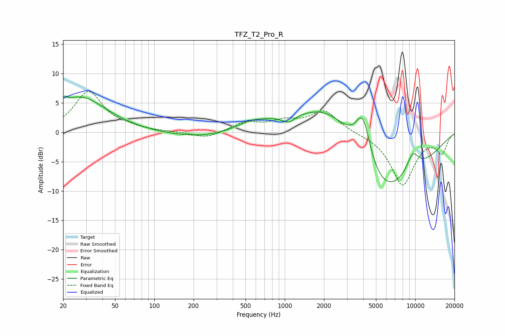

# TFZ_T2_Pro_R
See [usage instructions](https://github.com/jaakkopasanen/AutoEq#usage) for more options and info.

### Parametric EQs
Apply preamp of -6.3 dB when using parametric equalizer.

|   # | Type    |   Fc (Hz) |    Q |   Gain (dB) |
|-----|---------|-----------|------|-------------|
|   1 | Peaking |        20 | 5.89 |         1.2 |
|   2 | Peaking |        27 | 0.72 |         6   |
|   3 | Peaking |       241 | 0.53 |        -1.1 |
|   4 | Peaking |       537 | 1.47 |         0.7 |
|   5 | Peaking |       685 | 0.66 |         1.1 |
|   6 | Peaking |      1072 | 2.9  |        -1.3 |
|   7 | Peaking |      2242 | 0.56 |         9.1 |
|   8 | Peaking |      3973 | 2.26 |         8.6 |
|   9 | Peaking |      5241 | 0.45 |       -13.9 |
|  10 | Peaking |      9549 | 2.45 |         3.6 |

### Fixed Band EQs
When using fixed band (also called graphic) equalizer, apply preamp of **-7.1 dB** (if available) and set gains manually with these parameters.

|   # | Type    |   Fc (Hz) |    Q |   Gain (dB) |
|-----|---------|-----------|------|-------------|
|   1 | Peaking |        31 | 1.41 |         6.9 |
|   2 | Peaking |        62 | 1.41 |         0.5 |
|   3 | Peaking |       125 | 1.41 |         0   |
|   4 | Peaking |       250 | 1.41 |        -1.1 |
|   5 | Peaking |       500 | 1.41 |         1.6 |
|   6 | Peaking |      1000 | 1.41 |         1.6 |
|   7 | Peaking |      2000 | 1.41 |         3.6 |
|   8 | Peaking |      4000 | 1.41 |        -0.1 |
|   9 | Peaking |      8000 | 1.41 |        -8.9 |
|  10 | Peaking |     16000 | 1.41 |        -3.3 |

### Graphs

