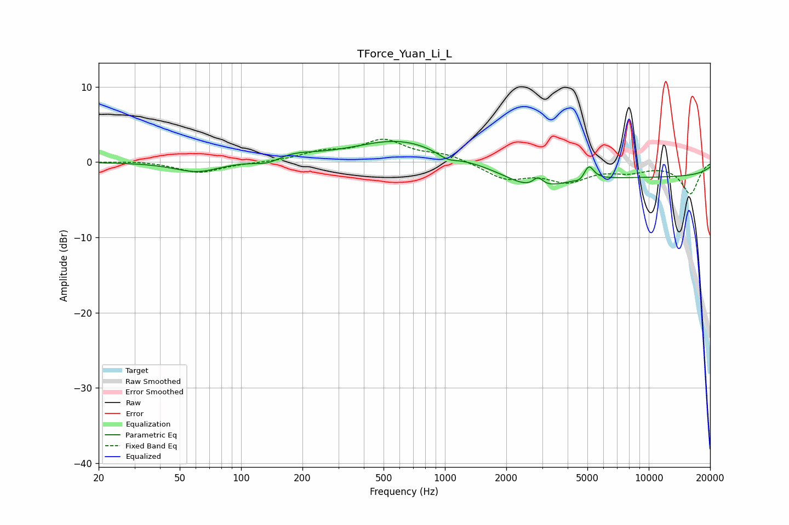

# TForce_Yuan_Li_L
See [usage instructions](https://github.com/jaakkopasanen/AutoEq#usage) for more options and info.

### Parametric EQs
Apply preamp of -2.8 dB when using parametric equalizer.

|   # | Type    |   Fc (Hz) |    Q |   Gain (dB) |
|-----|---------|-----------|------|-------------|
|   1 | Peaking |        61 | 1.29 |        -1.4 |
|   2 | Peaking |       137 | 2.02 |        -1   |
|   3 | Peaking |       170 | 1.18 |         1.1 |
|   4 | Peaking |       599 | 0.64 |         3   |
|   5 | Peaking |      1031 | 2.84 |        -0.8 |
|   6 | Peaking |      2726 | 1.05 |        -2.5 |
|   7 | Peaking |      2862 | 5.6  |         1.3 |
|   8 | Peaking |      4620 | 5.99 |        -0.5 |
|   9 | Peaking |      5080 | 5.71 |         1.9 |
|  10 | Peaking |     10000 | 0.18 |        -1.9 |

### Fixed Band EQs
When using fixed band (also called graphic) equalizer, apply preamp of **-3.1 dB** (if available) and set gains manually with these parameters.

|   # | Type    |   Fc (Hz) |    Q |   Gain (dB) |
|-----|---------|-----------|------|-------------|
|   1 | Peaking |        31 | 1.41 |         0.2 |
|   2 | Peaking |        62 | 1.41 |        -1.4 |
|   3 | Peaking |       125 | 1.41 |        -0.1 |
|   4 | Peaking |       250 | 1.41 |         1.2 |
|   5 | Peaking |       500 | 1.41 |         2.8 |
|   6 | Peaking |      1000 | 1.41 |         1   |
|   7 | Peaking |      2000 | 1.41 |        -2.1 |
|   8 | Peaking |      4000 | 1.41 |        -2.3 |
|   9 | Peaking |      8000 | 1.41 |        -1   |
|  10 | Peaking |     16000 | 1.41 |        -4.2 |

### Graphs

