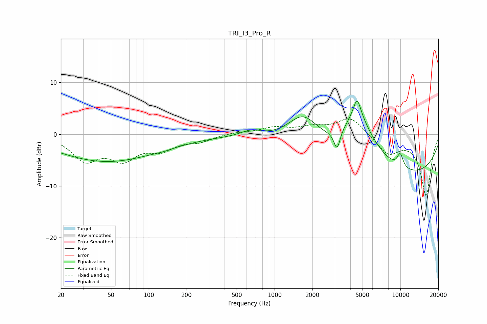

# TRI_I3_Pro_R
See [usage instructions](https://github.com/jaakkopasanen/AutoEq#usage) for more options and info.

### Parametric EQs
Apply preamp of -6.5 dB when using parametric equalizer.

|   # | Type    |   Fc (Hz) |    Q |   Gain (dB) |
|-----|---------|-----------|------|-------------|
|   1 | Peaking |        44 | 0.36 |        -4.3 |
|   2 | Peaking |        67 | 0.27 |        -1.1 |
|   3 | Peaking |       129 | 2.08 |        -0.2 |
|   4 | Peaking |       650 | 1.74 |         1.2 |
|   5 | Peaking |      1687 | 1.1  |         6.2 |
|   6 | Peaking |      3135 | 5.75 |        -3.7 |
|   7 | Peaking |      4522 | 4.8  |         3.7 |
|   8 | Peaking |      4598 | 0.98 |        10.2 |
|   9 | Peaking |      8079 | 0.18 |        -8.7 |
|  10 | Peaking |      9964 | 5.13 |         2.7 |

### Fixed Band EQs
When using fixed band (also called graphic) equalizer, apply preamp of **-3.1 dB** (if available) and set gains manually with these parameters.

|   # | Type    |   Fc (Hz) |    Q |   Gain (dB) |
|-----|---------|-----------|------|-------------|
|   1 | Peaking |        31 | 1.41 |        -4.7 |
|   2 | Peaking |        62 | 1.41 |        -4.3 |
|   3 | Peaking |       125 | 1.41 |        -2.6 |
|   4 | Peaking |       250 | 1.41 |        -1.2 |
|   5 | Peaking |       500 | 1.41 |         0.4 |
|   6 | Peaking |      1000 | 1.41 |         1.2 |
|   7 | Peaking |      2000 | 1.41 |         1.2 |
|   8 | Peaking |      4000 | 1.41 |         3.4 |
|   9 | Peaking |      8000 | 1.41 |        -3.6 |
|  10 | Peaking |     16000 | 1.41 |       -11.8 |

### Graphs

