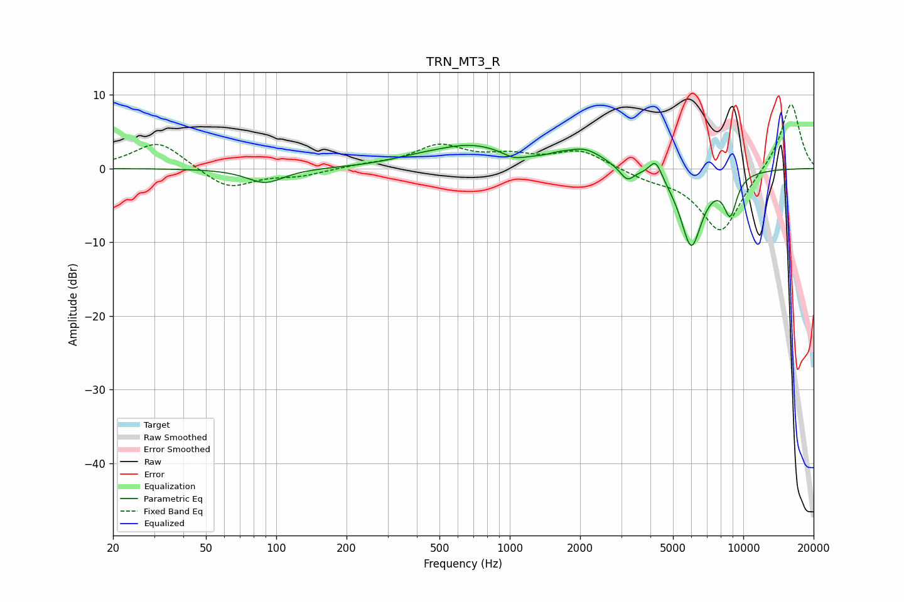

# TRN_MT3_R
See [usage instructions](https://github.com/jaakkopasanen/AutoEq#usage) for more options and info.

### Parametric EQs
Apply preamp of -3.2 dB when using parametric equalizer.

|   # | Type    |   Fc (Hz) |    Q |   Gain (dB) |
|-----|---------|-----------|------|-------------|
|   1 | Peaking |        90 | 1.81 |        -2   |
|   2 | Peaking |       394 | 1.24 |         0.5 |
|   3 | Peaking |       686 | 0.82 |         3   |
|   4 | Peaking |      1040 | 3.07 |        -0.8 |
|   5 | Peaking |      1611 | 3.05 |         0.4 |
|   6 | Peaking |      2094 | 1.69 |         2.3 |
|   7 | Peaking |      3182 | 4.57 |        -1.8 |
|   8 | Peaking |      4213 | 5.18 |         2.5 |
|   9 | Peaking |      5986 | 2.79 |       -10.5 |
|  10 | Peaking |      8798 | 4.57 |        -5.1 |

### Fixed Band EQs
When using fixed band (also called graphic) equalizer, apply preamp of **-8.8 dB** (if available) and set gains manually with these parameters.

|   # | Type    |   Fc (Hz) |    Q |   Gain (dB) |
|-----|---------|-----------|------|-------------|
|   1 | Peaking |        31 | 1.41 |         3.8 |
|   2 | Peaking |        62 | 1.41 |        -2.9 |
|   3 | Peaking |       125 | 1.41 |        -0.9 |
|   4 | Peaking |       250 | 1.41 |         0.4 |
|   5 | Peaking |       500 | 1.41 |         2.9 |
|   6 | Peaking |      1000 | 1.41 |         1.4 |
|   7 | Peaking |      2000 | 1.41 |         2.4 |
|   8 | Peaking |      4000 | 1.41 |        -1.1 |
|   9 | Peaking |      8000 | 1.41 |        -8.8 |
|  10 | Peaking |     16000 | 1.41 |         9.2 |

### Graphs

