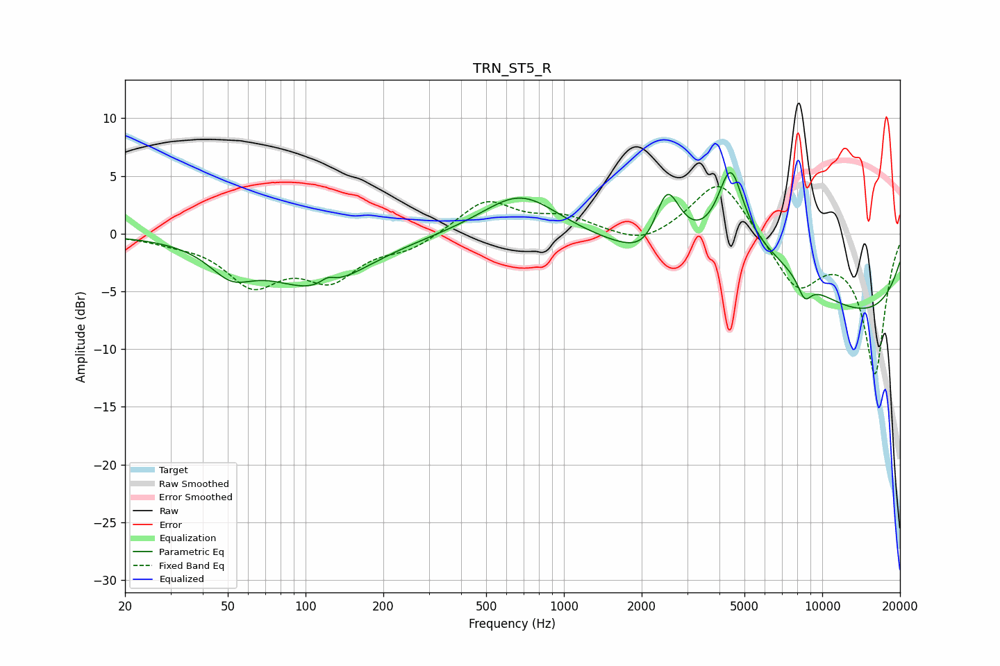

# TRN_ST5_R
See [usage instructions](https://github.com/jaakkopasanen/AutoEq#usage) for more options and info.

### Parametric EQs
Apply preamp of -5.4 dB when using parametric equalizer.

|   # | Type    |   Fc (Hz) |    Q |   Gain (dB) |
|-----|---------|-----------|------|-------------|
|   1 | Peaking |        51 | 1.7  |        -2.3 |
|   2 | Peaking |       110 | 0.73 |        -4.5 |
|   3 | Peaking |       122 | 4.99 |         0.6 |
|   4 | Peaking |       680 | 0.95 |         3.7 |
|   5 | Peaking |      2306 | 1.59 |        -4   |
|   6 | Peaking |      2494 | 2.39 |         8.1 |
|   7 | Peaking |      4423 | 2.83 |         6.8 |
|   8 | Peaking |      5547 | 0.54 |         5.3 |
|   9 | Peaking |      8545 | 4.86 |        -1.7 |
|  10 | Peaking |     10000 | 0.2  |        -8.2 |

### Fixed Band EQs
When using fixed band (also called graphic) equalizer, apply preamp of **-4.2 dB** (if available) and set gains manually with these parameters.

|   # | Type    |   Fc (Hz) |    Q |   Gain (dB) |
|-----|---------|-----------|------|-------------|
|   1 | Peaking |        31 | 1.41 |        -0.4 |
|   2 | Peaking |        62 | 1.41 |        -4.1 |
|   3 | Peaking |       125 | 1.41 |        -3.5 |
|   4 | Peaking |       250 | 1.41 |        -1.2 |
|   5 | Peaking |       500 | 1.41 |         2.9 |
|   6 | Peaking |      1000 | 1.41 |         1.3 |
|   7 | Peaking |      2000 | 1.41 |        -1.2 |
|   8 | Peaking |      4000 | 1.41 |         5   |
|   9 | Peaking |      8000 | 1.41 |        -4.6 |
|  10 | Peaking |     16000 | 1.41 |       -12   |

### Graphs

