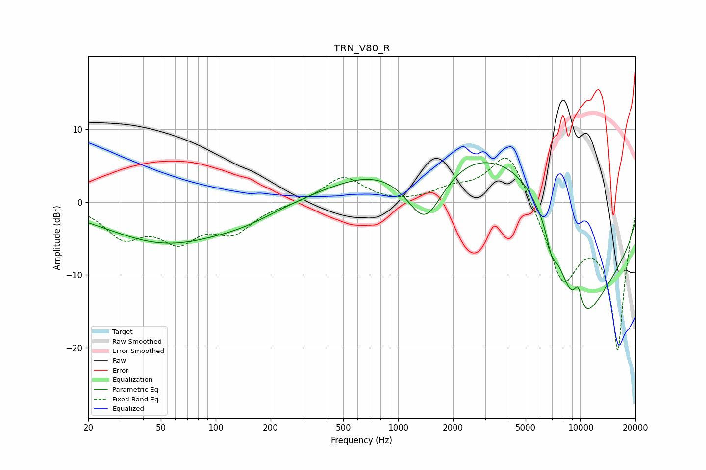

# TRN_V80_R
See [usage instructions](https://github.com/jaakkopasanen/AutoEq#usage) for more options and info.

### Parametric EQs
Apply preamp of -5.5 dB when using parametric equalizer.

|   # | Type    |   Fc (Hz) |    Q |   Gain (dB) |
|-----|---------|-----------|------|-------------|
|   1 | Peaking |        25 | 2.61 |         0   |
|   2 | Peaking |        53 | 0.42 |        -5.5 |
|   3 | Peaking |       146 | 0.8  |        -1.1 |
|   4 | Peaking |      1405 | 1.11 |       -11.2 |
|   5 | Peaking |      1494 | 0.35 |         7.7 |
|   6 | Peaking |      5676 | 0.37 |        14.7 |
|   7 | Peaking |      6929 | 5.08 |        -2.4 |
|   8 | Peaking |      9657 | 0.91 |       -12.6 |
|   9 | Peaking |      9683 | 4.77 |         4   |
|  10 | Peaking |     10000 | 0.28 |       -14.9 |

### Fixed Band EQs
When using fixed band (also called graphic) equalizer, apply preamp of **-6.1 dB** (if available) and set gains manually with these parameters.

|   # | Type    |   Fc (Hz) |    Q |   Gain (dB) |
|-----|---------|-----------|------|-------------|
|   1 | Peaking |        31 | 1.41 |        -4.4 |
|   2 | Peaking |        62 | 1.41 |        -4.6 |
|   3 | Peaking |       125 | 1.41 |        -3.7 |
|   4 | Peaking |       250 | 1.41 |        -0.2 |
|   5 | Peaking |       500 | 1.41 |         3.5 |
|   6 | Peaking |      1000 | 1.41 |        -0.3 |
|   7 | Peaking |      2000 | 1.41 |         1.5 |
|   8 | Peaking |      4000 | 1.41 |         7.7 |
|   9 | Peaking |      8000 | 1.41 |       -10.3 |
|  10 | Peaking |     16000 | 1.41 |       -20   |

### Graphs

