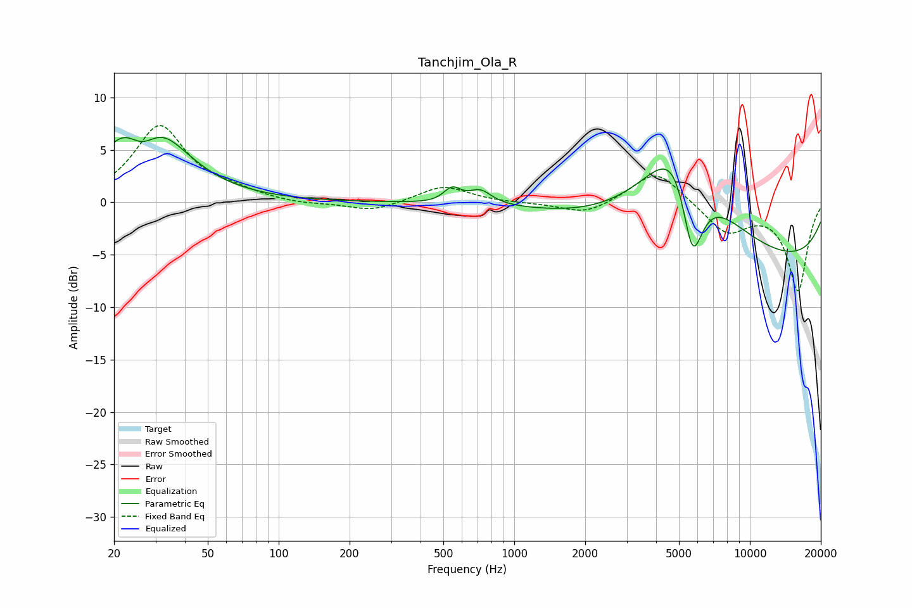

# Tanchjim_Ola_R
See [usage instructions](https://github.com/jaakkopasanen/AutoEq#usage) for more options and info.

### Parametric EQs
Apply preamp of -6.3 dB when using parametric equalizer.

|   # | Type    |   Fc (Hz) |    Q |   Gain (dB) |
|-----|---------|-----------|------|-------------|
|   1 | Peaking |        23 | 1.39 |         6.5 |
|   2 | Peaking |        23 | 0.84 |        -0.4 |
|   3 | Peaking |        26 | 1.4  |        -7.3 |
|   4 | Peaking |        30 | 1.07 |         8.8 |
|   5 | Peaking |       538 | 2.44 |        -0.6 |
|   6 | Peaking |       544 | 3.55 |         1.9 |
|   7 | Peaking |       717 | 2.92 |         1.3 |
|   8 | Peaking |      5068 | 0.9  |        13.3 |
|   9 | Peaking |      5691 | 2.59 |       -10.6 |
|  10 | Peaking |      9411 | 0.18 |        -6.2 |

### Fixed Band EQs
When using fixed band (also called graphic) equalizer, apply preamp of **-7.4 dB** (if available) and set gains manually with these parameters.

|   # | Type    |   Fc (Hz) |    Q |   Gain (dB) |
|-----|---------|-----------|------|-------------|
|   1 | Peaking |        31 | 1.41 |         7.2 |
|   2 | Peaking |        62 | 1.41 |         0.8 |
|   3 | Peaking |       125 | 1.41 |        -0.3 |
|   4 | Peaking |       250 | 1.41 |        -0.9 |
|   5 | Peaking |       500 | 1.41 |         1.6 |
|   6 | Peaking |      1000 | 1.41 |        -0.1 |
|   7 | Peaking |      2000 | 1.41 |        -1.2 |
|   8 | Peaking |      4000 | 1.41 |         3.2 |
|   9 | Peaking |      8000 | 1.41 |        -2.9 |
|  10 | Peaking |     16000 | 1.41 |        -8.4 |

### Graphs

