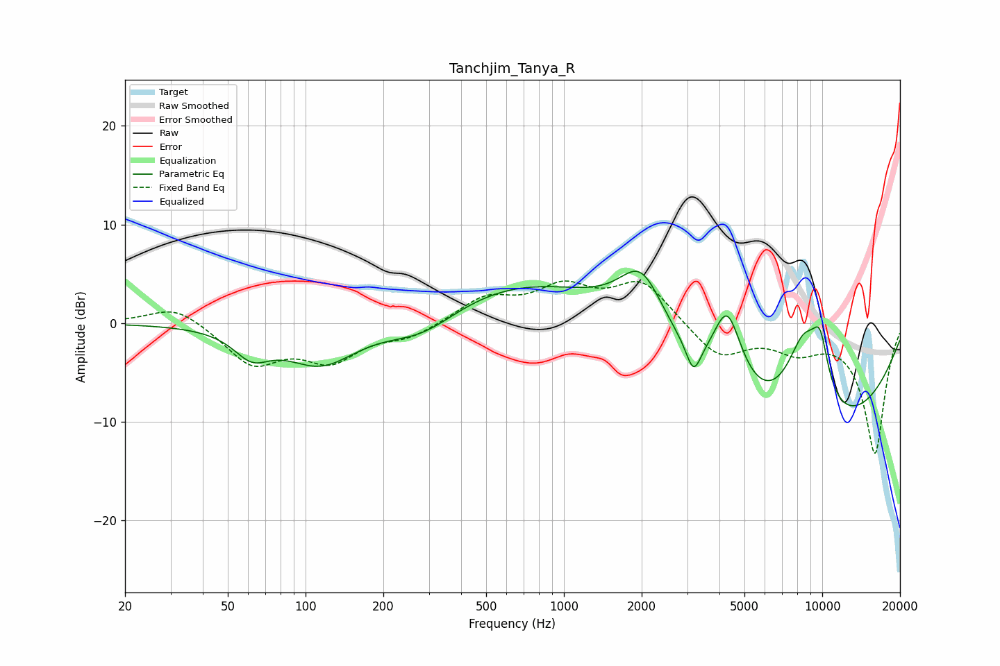

# Tanchjim_Tanya_R
See [usage instructions](https://github.com/jaakkopasanen/AutoEq#usage) for more options and info.

### Parametric EQs
Apply preamp of -5.3 dB when using parametric equalizer.

|   # | Type    |   Fc (Hz) |    Q |   Gain (dB) |
|-----|---------|-----------|------|-------------|
|   1 | Peaking |        62 | 2.06 |        -2.5 |
|   2 | Peaking |       115 | 1    |        -4.3 |
|   3 | Peaking |       283 | 0.95 |        -2.9 |
|   4 | Peaking |       825 | 0.33 |         5   |
|   5 | Peaking |      1997 | 1.57 |         6.5 |
|   6 | Peaking |      3177 | 4.99 |        -3.1 |
|   7 | Peaking |      4292 | 2.37 |         8.1 |
|   8 | Peaking |      8162 | 0.29 |       -13.6 |
|   9 | Peaking |      8496 | 1.55 |        10.2 |
|  10 | Peaking |      9817 | 3.92 |         4.7 |

### Fixed Band EQs
When using fixed band (also called graphic) equalizer, apply preamp of **-4.4 dB** (if available) and set gains manually with these parameters.

|   # | Type    |   Fc (Hz) |    Q |   Gain (dB) |
|-----|---------|-----------|------|-------------|
|   1 | Peaking |        31 | 1.41 |         1.9 |
|   2 | Peaking |        62 | 1.41 |        -4   |
|   3 | Peaking |       125 | 1.41 |        -3.5 |
|   4 | Peaking |       250 | 1.41 |        -1.3 |
|   5 | Peaking |       500 | 1.41 |         2.5 |
|   6 | Peaking |      1000 | 1.41 |         3.3 |
|   7 | Peaking |      2000 | 1.41 |         4.2 |
|   8 | Peaking |      4000 | 1.41 |        -3.5 |
|   9 | Peaking |      8000 | 1.41 |        -2.3 |
|  10 | Peaking |     16000 | 1.41 |       -13.2 |

### Graphs

