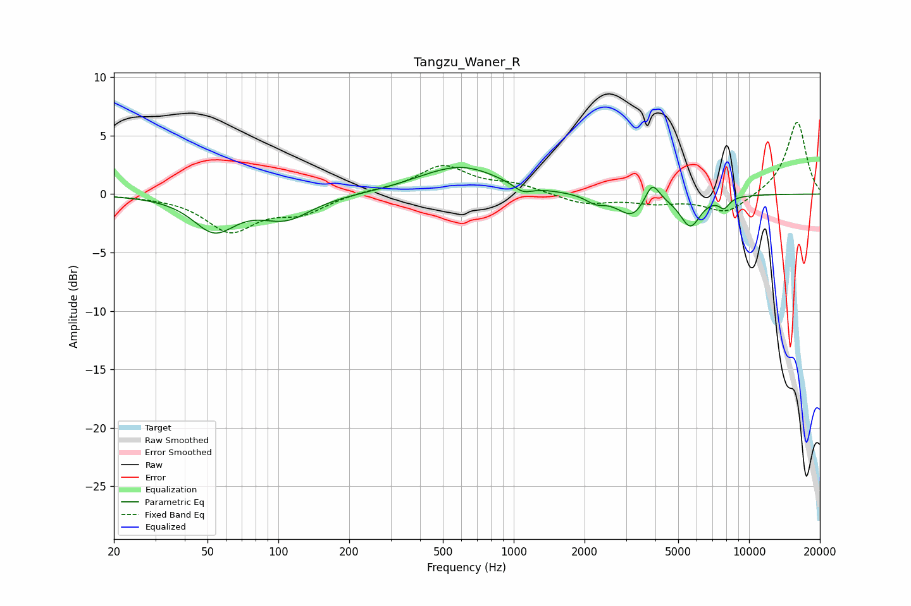

# Tangzu_Waner_R
See [usage instructions](https://github.com/jaakkopasanen/AutoEq#usage) for more options and info.

### Parametric EQs
Apply preamp of -2.4 dB when using parametric equalizer.

|   # | Type    |   Fc (Hz) |    Q |   Gain (dB) |
|-----|---------|-----------|------|-------------|
|   1 | Peaking |        53 | 1.58 |        -3   |
|   2 | Peaking |       108 | 1.3  |        -1.9 |
|   3 | Peaking |       403 | 1.23 |         0.2 |
|   4 | Peaking |       605 | 0.89 |         2.3 |
|   5 | Peaking |      1093 | 3.57 |        -0.7 |
|   6 | Peaking |      2226 | 3.46 |        -0.6 |
|   7 | Peaking |      3205 | 2.26 |        -2   |
|   8 | Peaking |      3870 | 4.36 |         2   |
|   9 | Peaking |      5628 | 3.22 |        -2.6 |
|  10 | Peaking |      7837 | 6    |        -0.9 |

### Fixed Band EQs
When using fixed band (also called graphic) equalizer, apply preamp of **-6.2 dB** (if available) and set gains manually with these parameters.

|   # | Type    |   Fc (Hz) |    Q |   Gain (dB) |
|-----|---------|-----------|------|-------------|
|   1 | Peaking |        31 | 1.41 |        -0.1 |
|   2 | Peaking |        62 | 1.41 |        -3.1 |
|   3 | Peaking |       125 | 1.41 |        -1.5 |
|   4 | Peaking |       250 | 1.41 |         0.3 |
|   5 | Peaking |       500 | 1.41 |         2.4 |
|   6 | Peaking |      1000 | 1.41 |         0.7 |
|   7 | Peaking |      2000 | 1.41 |        -0.8 |
|   8 | Peaking |      4000 | 1.41 |        -0.6 |
|   9 | Peaking |      8000 | 1.41 |        -1.6 |
|  10 | Peaking |     16000 | 1.41 |         6.3 |

### Graphs

